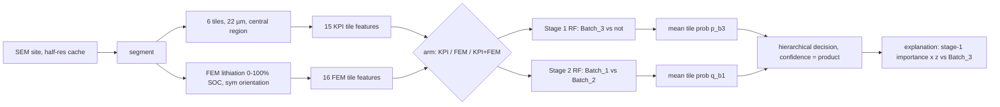

# Batch classifier: two-stage random forest vs Batch_3 (D18), KPI / FEM / KPI+FEM ablation

Binding inputs: `.claude/plans/fem-swelling.md` D8, D9, D10 (final), D17, D18 (architecture, FIXED by the user: do not reopen), D19 (documentation for the pitch deck). FEM output contract: `.claude/plans/fem-build.md` P14-P17 + Step 5 + Step 8 `fem_collect.py` (the r2 schema report `.claude/reports/fem-build.planner-r2.md` did not exist at planning time; all schema access is isolated in one loader, see C3 and Expected surprise 1). Rules: AGENTS.md (data/ and data_heldout/ read-only, never train on held-out sites, every held-out site gets batch + confidence + explanation vs Batch_3).

Branch: `fem-sim` (current). Commit at the end of Step 6; do not push or open a PR (the dispatcher does that).

## 1. Context

The project must assign each of the 3 held-out sites (`3e122cbj`, `fn0mhxef`, `xrv9xvzb`) to Batch_1/2/3, with a confidence and an explanation of how it differs from the Batch_3 supplier baseline, and must show (LOSO over the 31 labelled sites: 7 B1, 7 B2, 17 B3) whether FEM swelling features add anything over the existing image KPIs. The user fixed the architecture in D18: curated ~10-20 scalar features per tile, a two-stage random forest (stage 1 Batch_3 vs not; stage 2 Batch_1 vs Batch_2 on non-B3), mean tile-probability pooling per stage (D10 final), site confidence = product of stage probabilities, explanation = RF importance × per-feature z vs Batch_3, and an ablation KPI-only / FEM-only / KPI+FEM. FEM outputs (`outputs/fem/tile_curves.csv`) do not exist yet, so the KPI arm must run end to end on real data now and the full ablation must run with one command once the FEM tables land. D19 requires `docs/classifier/method.md` and a script-generated `docs/classifier/results.md`.

## 2. Design decisions

| # | Decision | Rationale |
|---|---|---|
| C1 | **File set** (disjoint from FEM): `pmdb/classify/{__init__,features,kpi_tiles,model,explain}.py`, `scripts/classify_batches.py`, `tests/test_classify.py` (no data), `tests/test_classify_data.py` (`pytestmark = pytest.mark.data`), `docs/classifier/method.md`, `docs/classifier/results.md` (script-written), `outputs/classifier/*`. | Brief item 7; FEM owns `pmdb/fem/*`, `modal_fem.py`, `scripts/*fem*`, `outputs/fem/`, `outputs/modal/`. |
| C2 | **FEM tile grid at half resolution.** `fem_grid_slices(width_half: int) -> list[slice]`: `wc = width_half // 2`; `e = np.linspace(200, wc - 200, 7).round().astype(int)`; return `[slice(2*a, 2*b) for a, b in zip(e[:-1], e[1:])]`. Tile x-range in µm = `start*0.05`, `stop*0.05`. | Reproduces P15 exactly (coarse h = 0.1 µm, `edge_px = round(20/0.1) = 200`, odd trailing column dropped by P3 coarsening) without importing `pmdb.fem` (may not exist yet). The loader cross-checks against the FEM table's `tile_x0_um/tile_x1_um` (C3). |
| C3 | **One FEM schema loader** `load_fem_tile_curves(path) -> pd.DataFrame` in `pmdb/classify/features.py`, the only code that knows `tile_curves.csv` column names. Schema constants at module top: `FEM_TILE_COL = ("tile", "region")` (use the first present), `FEM_CONFIG = "si"` (filter only if a `config` column exists), `FEM_ORIENTATION = "sym"`, `FEM_FRAMES = 11`, `FEM_REQUIRED_METRICS` (the 12 metrics in C4). Validation (raise `ValueError` with a message): required columns present; exactly tiles 0..5 × frames 0..10 per site after filtering; `abs(s - frame/10) < 1e-6`; one batch per site; `heldout == (batch == "Batch_heldout")` (parse `heldout` as bool from bool or "True"/"False" strings). Returns long rows (batch, site, heldout, tile, frame, s, tile_x0_um, tile_x1_um, metrics). | fem-build P17 (`sym` is the primary set), Step 5 (metric names, `region` = tile index in tile rows), D17 (only config `si`). Isolating the schema makes an r2 rename a constants-only edit. |
| C4 | **Curated FEM tile features (16)**, all from `sym` rows of one tile, frame k ⇔ s = k/10. See the table in §2a. Slopes are OLS slopes of `swelling` vs s over a frame set (NaN if any frame in the set is NaN). `fem_first_closure_s` is derived per tile from the tile's own `pore_closed_frac` series (the CSV's `first_pore_closure_s` is whole-domain, identical for every tile, so it is not used). | D18 list (swelling @50/100, pore area left @100, first closure SOC, p95 Si vM @100, interface stress, slopes 0-25 and 25-100). Frames do not include s = 0.25 (P9 breakpoint s* is a substep, not a frame), so "0-25%" = frames {0,1,2} (all before the kink) and "25-100%" = frames {3..10} (all after). There is no interface metric in the FEM contract; binder p95 vM is the proxy (binder sits between Si and graphite and carries the load transfer) and the docs say so. |
| C5 | **Curated KPI tile features (15)**: the 16 v1 per-tile catalogue columns (`catalogue_columns()[1]`, K01 K02 K03×3 K04×2 K05 K07×2 K09×2 K14×2 K15 K16), minus any column with zero variance over the 31 labelled sites' tiles (on the 4-tile grid this drops `K16_si_graphite_dist_median_um`, which is 0 everywhere). No other trimming. | Same feature set and drop rule as check 3 (`tile_signal_checks.load_tiles`), so the R1 reference is like-for-like in features; 15 is inside D18's 10-20; RF is insensitive to the collinear pairs (K03 d50/d90, K07 R_rl/R_csr, K14 p50/p95). The drop is label-free, so doing it once before LOSO leaks nothing. |
| C6 | **KPIs on the FEM grid without touching `pmdb/kpis`.** `pmdb/classify/kpi_tiles.py::compute_tile_kpis_on_grid(masks, bse_norm, nm_per_px, seed_prefix, slices)` is a copy of the loop body of `pmdb.kpis.compute_tile_kpis` with `tile_slices(masks.shape[1])` replaced by the `slices` argument (same `KpiContext`, `REGISTRY[k].tile_fn`, `TooFewObjects` → NaN + `nan_reason`, same seed key format `f"{seed_prefix}/tile{t}"`). Input preparation mirrors `scripts/run_kpis.py::process_site`: `raw = load_site(b, s, resolution="half", normalise="none", cache_root=cr)`, `norm = load_site(b, s, resolution="half", cache_root=cr)`, `masks = segment(raw)`, `bse_norm = norm.image[..., 0]`. Seed prefix for the 6-tile grid = `f"{batch}/{site}/g6"`. A data test proves the copy equals `compute_tile_kpis` on the 4-tile grid. | Brief item 2: existing KPI behaviour and committed `outputs/kpis/*` unchanged. Un-harmonised segmentation identical to the KPI pipeline and the FEM mesh (fem-build P24). |
| C7 | **KPI tile table** `outputs/classifier/kpi_tiles6.csv` (committed) for 31 labelled + 3 held-out sites: columns `batch, site, heldout, tile, tile_x0_um, tile_x1_um, <16 catalogue tile columns>, nan_reason`, sorted by (batch, site, tile). Held-out loaded with `cache_root="cache_heldout"` (batch `Batch_heldout`); labelled with the default cache root. Built by `python scripts/classify_batches.py kpi-tiles [--jobs 8]` (ProcessPoolExecutor, results sorted before writing). Any site exception → print it and exit 1 without writing. | Expensive step (segmentation) separated from the fast model run; one committed table makes `run` cheap and deterministic. |
| C8 | **Random forest (fixed, never tuned)**: `Pipeline([("imp", SimpleImputer(strategy="median", keep_empty_features=True)), ("rf", RandomForestClassifier(n_estimators=500, max_features="sqrt", min_samples_leaf=3, max_depth=None, bootstrap=True, class_weight="balanced", random_state=0, n_jobs=1))])`, one per stage, refitted per fold. | 500 trees stabilise MDI importances; sqrt features is the standard default; `min_samples_leaf=3` smooths noisy tiles (low ICC, check 1-2) on ~120-180 training tiles; `class_weight="balanced"` handles 17 vs 14 (stage 1) and is harmless at 7 vs 7 (stage 2); every site has 6 tiles, so tile-level balance = site-level balance. `n_jobs=1` keeps probability sums bit-reproducible (md5 check). sklearn 1.3.2 RF has no native NaN support, hence the imputer; `keep_empty_features=True` keeps the column count fixed so importances map to names. |
| C9 | **NaN policy.** (a) KPI `TooFewObjects` NaN and FEM metrics over an empty phase (e.g. no Si in a tile) → training-fold median. (b) FEM frames after a solver failure are NaN → features using them are NaN → training-fold median (no failure indicator feature). (c) `fem_first_closure_s`: no closure while the tile converged to s = 1 → sentinel 1.1 ("never closed"); no closure but frame 10 unconverged → NaN. | Median imputation inside the fold is leak-free and matches check 3. (c) distinguishes "never" (physical) from "unknown" (failure). Failures are expected to be rare (G5 gate: ≤ 3 of 34). |
| C10 | **Two-stage model and pooling.** Stage 1 label `y1 = batch == "Batch_3"` on all training tiles; stage 2 label `y2 = batch == "Batch_1"` on training tiles of true Batch_1/Batch_2 sites only. Both stages score every tile of a test site. Site pooling = plain mean over its 6 tiles: `p_b3 = mean(P1(B3))`, `q_b1 = mean(P2(B1))`. 3-class probabilities: `P_Batch_3 = p_b3`, `P_Batch_1 = (1-p_b3)*q_b1`, `P_Batch_2 = (1-p_b3)*(1-q_b1)`. **Decision is hierarchical**: `Batch_3` if `p_b3 >= 0.5`, else `Batch_1` if `q_b1 >= 0.5`, else `Batch_2`. **Confidence** = the product along the chosen branch (= `P_<predicted>`). Tile votes: stage 1 votes not-B3 if tile `P1(B3) < 0.5`; stage 2 votes B1 if tile `P2(B1) >= 0.5`. | D18 + D10 final. The hierarchical decision makes per-stage and end-to-end results consistent and keeps "is it Batch_3?" as the first question (the track spec's baseline framing). Known quirk (documented): with p_b3 just under 0.5 and q_b1 near 0.5, confidence can be < 0.5 and below P_Batch_3; that is reported honestly, not hidden by argmax. |
| C11 | **LOSO evaluation**, per arm: 31 folds (`LeaveOneGroupOut` on site); held-out sites never enter any fold. Levels: `stage1` (31 sites, classes Batch_3 / not_Batch_3, prob = p_b3), `stage2` (the 14 true B1/B2 sites, classes Batch_1 / Batch_2, prob = q_b1, regardless of the stage-1 outcome), `end_to_end` (31 sites, 3 classes, hierarchical decision). Metrics per level: `site_acc`, `balanced_acc`, `macro_f1`, `brier` (= `((P - Y)**2).mean()` over all class columns, check-3 convention), `bacc_ci_lo/hi` (1000 site resamples with replacement, `np.random.default_rng(0)` fresh per (arm, level), percentile 2.5/97.5, warnings suppressed: check-3 convention). Confusion matrix: end-to-end 3×3 counts per arm. Calibration: `end_to_end` bins on confidence `[0,0.5) [0.5,0.7) [0.7,0.9) [0.9,1.0]`; `stage1` and `stage2` bins on `max(p, 1-p)` `[0.5,0.7) [0.7,0.9) [0.9,1.0]`; columns n, mean_conf, accuracy. | Brief item 4; same CI method as check 3 so numbers are comparable; stage 2 evaluated on true non-B3 sites measures B1-vs-B2 separability independently of stage-1 errors. |
| C12 | **Pre-stated arm selection rule** (applied only among arms that ran): (1) take the max end-to-end LOSO balanced accuracy over arms; (2) every arm within 0.05 of it is tied; (3) among tied arms choose the lowest end-to-end Brier; (4) exact Brier ties broken by the order KPI+FEM, FEM, KPI. If FEM tables are absent only the KPI arm runs; it is final and the report marks the result **provisional (FEM arms not run)**. The report always states that differences < ~0.1 are within the bootstrap CI. | Fixed before seeing FEM numbers. Balanced accuracy is the primary metric (check 3); 0.05 is half the noise floor, so near-ties are decided on probabilistic quality (Brier) rather than noise in a 31-site accuracy. |
| C13 | **Final fit and held-out prediction**: for every arm that ran, fit both stages on all 31 labelled sites' tiles (assert no `heldout` row in training) and predict the 3 held-out sites; rows carry `final = (arm == selected arm)`. The explanation and the headline table use the final arm. | Showing all arms' held-out calls lets the pitch say whether the assignment is robust to the feature set, at negligible cost. |
| C14 | **Explanation vs Batch_3** (final arm, each held-out site): site value `x_f` = nan-mean of the site's 6 tile values; Batch_3 reference = the 17 labelled B3 sites' site values: `mu_f`, `sd_f` (ddof=1). `z_f = (x_f - mu_f)/sd_f` (NaN if `sd_f` is 0/NaN or `x_f` NaN; NaN features are skipped). `imp_f` = stage-1 MDI importance (`feature_importances_` of the final stage-1 RF). `score_f = imp_f * |z_f|`; top 3 by score (ties by feature name). Text template in Step 4. | D18. Stage 1 is the "vs Batch_3" question, so its importance is the right weight; site means make the z directly interpretable against the B3 site distribution. MDI is cheap and deterministic; its bias toward continuous high-variance features is listed as a limitation. |
| C15 | **Arms**: `KPI` = C5 features from `kpi_tiles6.csv`; `FEM` = C4 features; `KPI+FEM` = both, inner-joined on (batch, site, tile). Join check: per (site, tile) `|tile_x0_um_kpi - tile_x0_um_fem| <= 0.1` and same for x1, else `ValueError`; the joined table must keep all 34 sites × 6 tiles. External reference (not an arm): check-3 `R1_mean_prob` and `R4_site_kpis` rows of `outputs/pooling_checks/check3_metrics.csv` shown in the report. | D18 ablation; tile alignment is the only way the joint arm is meaningful. |
| C16 | **One command**: `python scripts/classify_batches.py run [--fem-tiles outputs/fem/tile_curves.csv] [--require-fem]`. Default `--fem-tiles` is `outputs/fem/tile_curves.csv`; if that file exists the three arms run, else only KPI (printed notice). `--require-fem` exits 2 if the file is missing. FEM sites must be the same 34 as `kpi_tiles6.csv` (else `ValueError`). | Brief item 6 and D19 ("results.md regenerates in one command when FEM outputs land"). |
| C17 | **Outputs** (`outputs/classifier/`, floats `float_format="%.6g"`, rows sorted, no timestamps anywhere): `feature_catalogue.csv` (feature, arm_source KPI/FEM, source, meaning), `loso_site_predictions.csv`, `loso_tile_predictions.csv`, `metrics.csv`, `confusion.csv`, `calibration.csv`, `importance.csv` (final fit, all arms), `heldout_predictions.csv`, `heldout_tiles.csv`, `heldout_zscores.csv`, `fig_confusion.png`, `fig_importance.png`, `report.md`, `run_log.json` (git commit, argv, package versions, RF params, input file md5s, arms run, selected arm). The same markdown is written to `docs/classifier/results.md` with figure links prefixed `../../outputs/classifier/`. | Brief item 5 + D19 (every number script-generated; figures PNG under outputs/). No timestamps so two runs are byte-identical. |
| C18 | **`docs/classifier/method.md` is hand-written** from this plan (architecture, mermaid diagram, feature tables, protocol, selection rule, limitations). It contains design constants (tile count, frames, RF hyperparameters) but **no result numbers**; all results live in the script-written `results.md`. | D19 "every number generated by a script" applies to results; design constants are inputs, copied from this plan. |
| C19 | **Development without FEM data**: tests build a synthetic long-format `tile_curves` DataFrame matching C3's schema (`region` column, orientations bottom/top/sym, config `si`, 11 frames, required metrics) with an injected B3 signal and one failed tile series. | Brief item 6; exercises loader, features, NaN path, three arms, and explanation without FEM outputs. |

### 2a. Curated FEM features (C4), `sym` orientation, one tile

| feature | source metric @ frame(s) | physical meaning |
|---|---|---|
| `fem_swell_50` | `swelling` @ 5 | electrode thickness strain at 50% SOC |
| `fem_swell_100` | `swelling` @ 10 | electrode thickness strain at full charge |
| `fem_swell_slope_early` | OLS slope of `swelling` vs s, frames 0-2 | swelling rate in the Si-dominated stage (s < s* = 0.25) |
| `fem_swell_slope_late` | OLS slope of `swelling` vs s, frames 3-10 | swelling rate once graphite lithiation dominates (s > 0.25) |
| `fem_surface_rough_100` | `surface_rough` @ 10 | non-uniformity of the free-surface rise across the tile |
| `fem_pore_left_100` | `1 + porosity_rel_change` @ 10 | fraction of the initial pore area still open at full charge (pore accommodation used up) |
| `fem_pore_closed_frac_100` | `pore_closed_frac` @ 10 | fraction of pore cells collapsed (J < 0.1) at full charge |
| `fem_first_closure_s` | first s with tile `pore_closed_frac` > 0 (1.1 if never, C9) | SOC at which the first pore is crushed (early = Si packed against pores) |
| `fem_vm_si_p95_100` | `vm_si_p95_MPa` @ 10 | peak Si von Mises stress (particle fracture driver) |
| `fem_si_yield_frac_100` | `si_yield_frac` @ 10 | fraction of Si above its lithiation-dependent yield stress |
| `fem_p_si_mean_100` | `p_si_mean_MPa` @ 10 | mean hydrostatic compression of Si (how strongly the matrix confines Si) |
| `fem_vm_binder_p95_100` | `vm_binder_p95_MPa` @ 10 | peak binder stress: proxy for Si/matrix interface load transfer (debonding risk) |
| `fem_vm_gr_p95_100` | `vm_gr_p95_MPa` @ 10 | peak graphite stress imposed by swelling Si neighbours |
| `fem_sxx_mean_100` | `sxx_mean_MPa` @ 10 | mean in-plane stress (lateral constraint; curling/delamination driver) |
| `fem_J_si_mean_100` | `J_si_mean` @ 10 | realised Si volume expansion (below the free 3.24 when confined) |
| `fem_band_vm_maxdev_100` | `band_vm_maxdev` @ 10 | through-thickness heterogeneity of stress (depth-band max deviation) |

`FEM_REQUIRED_METRICS = ("swelling", "surface_rough", "porosity_rel_change", "pore_closed_frac", "vm_si_p95_MPa", "si_yield_frac", "p_si_mean_MPa", "vm_binder_p95_MPa", "vm_gr_p95_MPa", "sxx_mean_MPa", "J_si_mean", "band_vm_maxdev")`.

### 2b. Curated KPI tile features (C5), meanings from `docs/kpis/kpi_catalogue.csv`

| feature | meaning |
|---|---|
| `K01_si_frac_adm` | Si area / non-artefact area (Si loading) |
| `K02_si_density_per_1000um2` | Si objects per 1000 µm² |
| `K03_ecd_d50_um`, `K03_ecd_d90_um`, `K03_ecd_max_um` | Si particle equivalent-circle diameter median / 90th pct / max |
| `K04_agglom_frac` | share of Si area in agglomerates (clusters with ECD > 5 µm) |
| `K04_n_clusters_per_1000um2` | Si cluster count density |
| `K05_voronoi_sigma` | spread of Voronoi cell areas of Si centroids (dispersion non-uniformity) |
| `K07_R_rl`, `K07_R_csr` | nearest-neighbour index vs random labelling / CSR (< 1 clustered) |
| `K09_mst_m_norm`, `K09_mst_sigma_norm` | normalised mean / SD of minimum-spanning-tree edge lengths over Si |
| `K14_empty_p50_um`, `K14_empty_p95_um` | median / 95th pct distance to the nearest Si (Si-free pockets) |
| `K15_si_graphite_contact_frac` | share of Si boundary touching graphite |
| `K16_si_graphite_dist_median_um` | median Si-to-graphite distance (dropped if zero-variance, C5) |

## 3. Out of scope (do NOT touch)

- `data/`, `data_heldout/` (never write); `cache/`, `cache_heldout/` (read only).
- `pmdb/kpis/**`, `pmdb/io.py`, `pmdb/segment.py`, `pmdb/harmonise.py`, `scripts/run_kpis.py`, `outputs/kpis/**`, `outputs/pooling_checks/**`, `scripts/pooling_compare.py`, `scripts/tile_signal_checks.py` (import only).
- Everything FEM: `pmdb/fem/**`, `modal_fem.py`, `scripts/*fem*`, `configs/fem/**`, `outputs/fem/**`, `outputs/modal/**`, `docs/fem/**`.
- `docs/pitch-brief.md` (writer lane), `.claude/plans/fem-*.md`.
- No hyperparameter search, no other model families, no feature selection beyond C5's zero-variance drop, no full-curve/PCA/time-series features (D18), no `harmonise=` other than `"none"`, no Modal.

## 4. Steps

### Step 1 — Feature specs, FEM grid, FEM loader and FEM tile features

Targets: `pmdb/classify/__init__.py` (docstring only), `pmdb/classify/features.py`, `tests/test_classify.py` (new). Every module starts with `from __future__ import annotations`.

`features.py` contents:

```python
BATCHES = ["Batch_1", "Batch_2", "Batch_3"]
HELDOUT_BATCH = "Batch_heldout"
TILE_ID = ["batch", "site", "tile"]
FEM_TILE_COL = ("tile", "region"); FEM_CONFIG = "si"; FEM_ORIENTATION = "sym"; FEM_FRAMES = 11
FEM_REQUIRED_METRICS = (...)                     # §2a
FEM_FEATURES: dict[str, tuple[str, str]]          # name -> (source, meaning), §2a order
KPI_MEANINGS: dict[str, str]                      # column -> meaning, §2b (all 16 catalogue tile columns)
CLOSURE_NEVER = 1.1

def fem_grid_slices(width_half: int) -> list[slice]            # C2
def load_fem_tile_curves(path: str | Path) -> pd.DataFrame     # C3, long rows
def fem_tile_features(curves: pd.DataFrame) -> pd.DataFrame    # one row per (batch, site, tile):
    # TILE_ID + heldout + tile_x0_um + tile_x1_um + 16 fem_* columns, sorted by TILE_ID
def kpi_feature_columns(kpi_tiles: pd.DataFrame) -> list[str]  # C5: catalogue tile columns (catalogue order)
    # minus those with zero nan-std over rows with heldout == False
def load_kpi_tiles6(path: str | Path) -> pd.DataFrame          # read CSV, parse heldout bool, assert 6 tiles/site
def build_arm_table(arm: str, kpi: pd.DataFrame | None, fem: pd.DataFrame | None
                    ) -> tuple[pd.DataFrame, list[str]]        # arm in {"KPI","FEM","KPI+FEM"}; C15 join + check
def feature_catalogue(features: list[str]) -> pd.DataFrame     # feature, arm_source, source, meaning
```

`fem_tile_features` sketch (per (site, tile) group, metrics indexed by frame 0..10):

```python
def ols_slope(s, y):           # NaN if any y is NaN
    return np.nan if np.isnan(y).any() else float(np.polyfit(s, y, 1)[0])
row["fem_swell_slope_early"] = ols_slope(s[0:3], sw[0:3])
row["fem_swell_slope_late"]  = ols_slope(s[3:11], sw[3:11])
row["fem_pore_left_100"] = 1.0 + prc[10]
closed = np.flatnonzero(np.nan_to_num(pcf, nan=0.0) > 0)
row["fem_first_closure_s"] = (s[closed[0]] if closed.size else
                              (CLOSURE_NEVER if np.isfinite(pcf[10]) else np.nan))
```

Tests in `tests/test_classify.py` (a module-level helper `synthetic_tile_curves(n_sites=(4, 4, 6), n_heldout=2, seed=0) -> pd.DataFrame` builds the fixture: `region` column (tile index 0..5), orientations bottom/top/sym, `config="si"`, frames 0..10, `s = frame/10`, `converged`, `tile_x0_um/tile_x1_um` from `fem_grid_slices(3494)` × 0.05, `first_pore_closure_s`, `failed_at_s`, every required metric plus one unused extra metric; `swelling = s * (0.05 + 0.02*is_B3 + 0.01*is_B1) + N(0, 0.001)`, the other metrics random with a B3 shift; tile 0 of the first Batch_1 site has all metrics NaN and `converged=False` at frames 7-10; `pore_closed_frac` > 0 from frame 6 on for B3 tiles, always 0 elsewhere. A companion helper `synthetic_kpi_tiles(curves)` builds a KPI table for the same (batch, site, tile) keys with the 16 catalogue tile columns, random values, `K16_si_graphite_dist_median_um` constant 0, and x-ranges equal to the fixture's):
- `test_fem_grid_slices`: `fem_grid_slices(3494)` → 6 contiguous slices, first start 400, last stop 3094 (P15 test (a) scaled ×2).
- `test_fem_loader_filters_and_validates`: loader returns only sym rows, tile ids 0..5; dropping one tile of one site raises `ValueError`; renaming `region`→`tile` still loads.
- `test_fem_features`: 16 `fem_*` columns; on a noise-free linear swelling `0.05*s` the early and late slopes equal 0.05 (rel 1e-9); failed tile has NaN `fem_swell_100` and NaN `fem_first_closure_s`; a converged never-closed tile has 1.1; a B3 tile has 0.6.
- `test_arm_join_checks_alignment`: KPI+FEM join of a synthetic KPI table (same TILE_ID, x-ranges from `fem_grid_slices`) succeeds with 15+16 features once K16 is constant; shifting one `tile_x0_um` by 0.5 raises `ValueError`.

Verification: `pytest -q tests/test_classify.py` — 4 passed.

### Step 2 — KPIs on the FEM grid; `kpi-tiles` subcommand; build the table

Targets: `pmdb/classify/kpi_tiles.py`, `scripts/classify_batches.py` (new; argparse subcommands `kpi-tiles` and `run`; `run` added in Step 5), `tests/test_classify_data.py` (new).

```python
def compute_tile_kpis_on_grid(masks: Masks, bse_norm: np.ndarray | None, nm_per_px: float,
                              seed_prefix: str, slices: list[slice]) -> list[dict[str, object]]   # C6
def site_kpi_tiles6(batch: str, site: str, cache_root: str | None) -> list[dict[str, object]]
    # C6 input prep; slices = fem_grid_slices(masks.shape[1]); rows get batch, site,
    # heldout = (batch == HELDOUT_BATCH), tile, tile_x0_um = sl.start*nm/1000, tile_x1_um = sl.stop*nm/1000
```

`classify_batches.py kpi-tiles --jobs 8 --out outputs/classifier/kpi_tiles6.csv`: sites = sorted (batch, site) from `cache/half/manifest.csv` (cache_root None) + `cache_heldout/half/manifest.csv` (cache_root `str(ROOT / "cache_heldout")`); C7 columns and behaviour. Script header follows `scripts/pooling_compare.py` (ROOT, `sys.path` inserts for ROOT and ROOT/scripts).

`tests/test_classify_data.py` (marked data):
- `test_grid_copy_matches_original`: for `Batch_1/4ih2ggld`, `compute_tile_kpis_on_grid(masks, bse, 50.0, "Batch_1/4ih2ggld", tile_slices(W))` equals `pmdb.kpis.compute_tile_kpis(masks, bse, 50.0, "Batch_1/4ih2ggld")` row by row (floats with `np.testing.assert_allclose(..., rtol=0, atol=0, equal_nan=True)`, `nan_reason` equal).
- `test_kpi_tiles6_table`: the committed CSV has 34 sites × 6 tiles, 3 sites with `heldout` True all `Batch_heldout`, per site `tile_x0_um` of tile 0 = `fem_grid_slices(width)[0].start*0.05` using widths from the two manifests.

Run `python scripts/classify_batches.py kpi-tiles --jobs 8` (expected a few minutes).

Verification: exit 0; `outputs/classifier/kpi_tiles6.csv` has 204 rows; `pytest -q -m data tests/test_classify_data.py` — 2 passed. Print and record the per-column NaN counts.

### Step 3 — Two-stage RF, LOSO, metrics, bootstrap, calibration, arm selection

Target: `pmdb/classify/model.py`; tests in `tests/test_classify.py`.

```python
RF_PARAMS = dict(n_estimators=500, max_features="sqrt", min_samples_leaf=3, max_depth=None,
                 bootstrap=True, class_weight="balanced", random_state=0, n_jobs=1)
N_BOOT = 1000; SEED = 0; SELECT_TIE_BACC = 0.05; ARM_ORDER = ["KPI+FEM", "FEM", "KPI"]
def make_stage_model() -> Pipeline                                   # C8
@dataclass
class TwoStage:
    features: list[str]
    stage1: Pipeline | None = None
    stage2: Pipeline | None = None
    def fit(self, tiles: pd.DataFrame) -> "TwoStage"                  # C10; raises if tiles.heldout.any()
    def tile_probs(self, tiles: pd.DataFrame) -> pd.DataFrame        # TILE_ID + p_b3, q_b1 (prob of class 1 via classes_)
def combine(p_b3: float, q_b1: float) -> dict                        # P_Batch_1/2/3, predicted, confidence (C10)
def site_predictions(tile_probs: pd.DataFrame) -> pd.DataFrame       # per site: mean p_b3, q_b1, combine(),
    # n_tiles, stage1_votes_not_b3, stage2_votes_b1
def loso(table: pd.DataFrame, features: list[str]) -> tuple[pd.DataFrame, pd.DataFrame]
    # labelled rows only; LeaveOneGroupOut on site; returns (site preds with true batch, tile probs)
def level_metrics(preds: pd.DataFrame) -> pd.DataFrame               # C11: rows level x metrics incl. CI
def confusion(preds: pd.DataFrame) -> pd.DataFrame                   # true, predicted, n (all 9 cells)
def calibration(preds: pd.DataFrame) -> pd.DataFrame                 # C11 bins
def select_arm(metrics: pd.DataFrame) -> str                         # C12 on level == "end_to_end"
```

Tests (no data): 
- `test_combine`: `combine(0.7, 0.2)` → Batch_3, conf 0.7; `combine(0.4, 0.75)` → Batch_1, conf 0.45, probabilities sum to 1; `combine(0.45, 0.5)` → Batch_1 (q ≥ 0.5), conf 0.275.
- `test_two_stage_loso_synthetic`: FEM arm on the Step-1 fixture; end-to-end balanced accuracy ≥ 0.9; held-out rows absent from output; `TwoStage().fit` on a table containing a held-out row raises.
- `test_loso_deterministic`: two `loso` calls return identical frames (`pd.testing.assert_frame_equal`, exact).
- `test_select_arm`: bacc {KPI 0.60, FEM 0.62, KPI+FEM 0.70} → KPI+FEM; {KPI 0.66 brier 0.15, FEM 0.68 brier 0.20, KPI+FEM 0.50} → KPI; single arm → that arm.
- `test_metrics_shapes`: levels stage1/stage2/end_to_end with n_sites 14/8/14 on the fixture (4+4 non-B3), `bacc_ci_lo <= balanced_acc <= bacc_ci_hi`.

Verification: `pytest -q tests/test_classify.py` — 9 passed.

### Step 4 — Explanation vs Batch_3

Target: `pmdb/classify/explain.py`; tests in `tests/test_classify.py`.

```python
def site_means(table: pd.DataFrame, features: list[str]) -> pd.DataFrame       # nan-mean of tiles per site
def zscores_vs_b3(site_vals: pd.DataFrame, features: list[str], importance: dict[str, float]
                  ) -> pd.DataFrame
    # rows for non-B3-reference sites given (held-out): site, feature, site_value, b3_mean, b3_std, z,
    # importance_stage1, score, rank (1 = largest score; NaN z rows kept with rank NaN)
def explanation_text(site: str, pred: dict, z: pd.DataFrame, meanings: dict[str, str], top_k: int = 3) -> str
```

Exact text (numbers with the shown formats; `{dir}` = "higher" if z > 0 else "lower"):

```
{site}: assigned {predicted} (confidence {confidence:.2f}; P(Batch_3) = {p_b3:.2f}, P(Batch_1 | not Batch_3) = {q_b1:.2f}; {stage1_votes_not_b3}/{n_tiles} tiles vote not-Batch_3). Versus Batch_3: {meaning1} is {dir} ({feature1} {x:.3g} vs Batch_3 {mu:.3g} ± {sd:.3g}, z = {z:+.1f}); {meaning2} ...; {meaning3} ....
```

If every listed |z| < 1, append ` No top feature deviates from Batch_3 by more than 1 SD.` Features are listed in rank order.

Tests: `test_zscores_and_text` with a hand-built table (3 B3 sites with values 1, 2, 3 → mu 2, sd 1; held-out value 4 → z +2.0) checks z, rank by importance × |z|, and that the text contains `z = +2.0` and `higher`; `test_text_all_small_z` checks the appended sentence.

Verification: `pytest -q tests/test_classify.py` — 11 passed.

### Step 5 — `run` subcommand: ablation, final fit, held-out predictions, figures, report

Target: `scripts/classify_batches.py` (`run`), reusing `md_table` from `scripts/tile_signal_checks.py` (import pattern of `pooling_compare.py`).

`run` flow (C11-C17):
1. Load `kpi_tiles6.csv`; FEM per C16 (`load_fem_tile_curves` → `fem_tile_features`); arms in `ARM_ORDER` restricted to those available.
2. Per arm: `build_arm_table`, `loso`, `level_metrics`, `confusion`, `calibration`; final `TwoStage().fit` on labelled rows, held-out `tile_probs` → `site_predictions`; stage-1/2 `feature_importances_` into `importance.csv` (arm, stage, feature, importance, rank).
3. `select_arm`; for the final arm: `site_means`, `zscores_vs_b3` with stage-1 importance, `explanation_text` per held-out site (the explanation column is filled only for `final` rows).
4. Write the C17 CSVs. Column orders: `loso_site_predictions.csv` = arm, batch, site, p_b3, q_b1, P_Batch_1, P_Batch_2, P_Batch_3, predicted, confidence, correct, n_tiles, stage1_votes_not_b3, stage2_votes_b1; `heldout_predictions.csv` = arm, final, site, predicted, confidence, p_b3, q_b1, P_Batch_1, P_Batch_2, P_Batch_3, n_tiles, stage1_votes_not_b3, stage2_votes_b1, explanation; `heldout_tiles.csv` = arm, site, tile, p_b3, q_b1, stage1_vote_not_b3, stage2_vote_b1; `metrics.csv` = arm, level, n_sites, site_acc, balanced_acc, bacc_ci_lo, bacc_ci_hi, macro_f1, brier.
5. Figures (matplotlib Agg, dpi 150): `fig_confusion.png` one panel per arm (3×3 counts annotated, rows true, cols predicted, title `"{arm}: bacc {x:.2f} [{lo:.2f}, {hi:.2f}]"`); `fig_importance.png` two panels (stage 1, stage 2) of the final arm, top 10 features, horizontal bars.
6. Report (one renderer `render_report(fig_prefix: str) -> str`, written to `outputs/classifier/report.md` with prefix `""` and `docs/classifier/results.md` with prefix `"../../outputs/classifier/"`). Sections in order: title + one-line status (`final arm: X` or `provisional (FEM arms not run): KPI`); Inputs (paths, md5, arms, feature counts); **Held-out predictions** (final arm: site, predicted, confidence, p_b3, q_b1, votes; then each explanation as a bullet; then a compact all-arms table site × arm → predicted (confidence)); **LOSO ablation** (`metrics.csv` as a table); selection rule text (C12) and the result of applying it; confusion figure link + end-to-end confusion table of the final arm; calibration table; importance figure link + top-5 per stage table; external reference (check-3 R1/R4 rows: rule, task, balanced_acc, bacc_ci_lo, bacc_ci_hi) with the note "flat logistic on 4-tile KPIs; not the same task structure"; caveat "31 labelled sites: differences below ~0.1 balanced accuracy are within the bootstrap CI". Print the end-to-end metrics rows to stdout.

Verification:
- `python scripts/classify_batches.py run` exits 0, prints "FEM tables not found: KPI arm only" (if absent) and the KPI stage1/stage2/end_to_end balanced accuracies.
- Determinism: run it twice; `md5 -q outputs/classifier/*.csv outputs/classifier/report.md docs/classifier/results.md` identical across the runs (PNGs excluded).
- `python scripts/classify_batches.py run --require-fem` exits 2 while `outputs/fem/tile_curves.csv` is absent.
- Smoke the FEM path: write the Step-1 fixture for the real 34 sites to `/tmp/fem_fixture.csv` (one-off snippet using `synthetic_tile_curves`-style generation with the real site list and `kpi_tiles6.csv` x-ranges) and run `python scripts/classify_batches.py run --fem-tiles /tmp/fem_fixture.csv --out /tmp/clf_smoke` — three arms in `metrics.csv`. For this, `run` takes `--out` (default `outputs/classifier`) and `--docs` (default `docs/classifier/results.md`; the smoke passes `--docs /tmp/clf_smoke/results.md`). Then re-run the plain `run` so committed outputs are KPI-only real results.

### Step 6 — Method doc, output data tests, full suite, commit

Targets: `docs/classifier/method.md` (new), `tests/test_classify_data.py` (extend).

`method.md` sections (C18; no result numbers; link `results.md`, `../fem/method.md`, `../../.claude/plans/fem-swelling.md` D18):
1. Goal (held-out assignment vs Batch_3 baseline; ablation question).
2. Architecture, with this diagram:



3. Features: the §2a and §2b tables verbatim.
4. Model and evaluation: C8-C12 in prose (RF params, NaN policy, LOSO, levels, metrics, bootstrap, calibration, selection rule).
5. Held-out prediction and explanation: C13-C14.
6. Reproduce: the two commands.
7. Limitations: 31 sites so CIs ~±0.2 and sub-0.1 differences are noise; tiles of one site are not independent (site is the unit; tile votes are not extra evidence); hierarchical decision can give confidence < 0.5; the classifier always picks one of 3 batches (a held-out site from an unseen supplier is still assigned; large |z| vs Batch_3 is the only warning); MDI importance favours continuous high-variance features; FEM features inherit the 2D elastic, pure-Si, sym-orientation assumptions (D17, fem method doc); binder p95 stress is only a proxy for interface stress; 22 µm tiles make KPIs noisier than the 44 µm grid used in check 3.

Add to `tests/test_classify_data.py`: `test_outputs_consistent` — `loso_site_predictions.csv` has 31 sites per arm and no `Batch_heldout`; `heldout_predictions.csv` has exactly the 3 held-out sites per arm, one `final` arm, non-empty explanation on final rows, confidence in (0, 1]; `metrics.csv` has 3 levels per arm.

Verification: `pytest -q -m "not data"` and `pytest -q -m data` both pass (all pre-existing tests included). Then commit only: `pmdb/classify/`, `scripts/classify_batches.py`, `tests/test_classify.py`, `tests/test_classify_data.py`, `docs/classifier/`, `outputs/classifier/`, `.claude/plans/classifier.md`, message `feat(classify): two-stage RF batch classifier vs Batch_3 (D18), KPI arm on 6-tile FEM grid`.

### Step 7 — Full ablation (only when `outputs/fem/tile_curves.csv` exists)

If the file is absent when Step 6 is done, skip this step and say so in the report. Otherwise: `python scripts/classify_batches.py run --require-fem`; run it twice for the md5 check; `pytest -q -m data tests/test_classify_data.py`; commit `outputs/classifier/` and `docs/classifier/results.md` with message `results(classify): KPI/FEM/KPI+FEM ablation and held-out predictions`.

Verification: `metrics.csv` has 3 arms × 3 levels; report status line names the final arm (no "provisional").

## 5. Expected surprises

1. **FEM schema differs from C3** (r2 planner may rename). Pre-authorized: if the change is a one-to-one rename (tile column, orientation label, config value or absence of `config`, metric name with the same definition), edit only the C3 constants / the metric-name mapping in `features.py` and log it. If a metric used in §2a is removed or redefined, or tiles are not 6 per site, or frames are not 11: STOP and escalate (a feature-list decision).
2. **Tile x-range mismatch** in the C15 join (> 0.1 µm): means C2 does not reproduce P15. STOP and escalate with the first mismatching site; do not loosen the tolerance.
3. **More zero-variance KPI columns on the 6-tile grid** than K16 (or K16 not constant): pre-authorized; C5's rule decides automatically. Report the dropped list.
4. **Many NaN KPI tile values** (`TooFewObjects` on 22 µm tiles): pre-authorized if ≤ 10% of labelled tiles for every column (median imputation handles it). If any column exceeds 10%, drop that column from the KPI feature list, report it, and continue (this extends C5's drop rule; it is the only additional trim allowed).
5. **`kpi-tiles` runtime** much longer than run_kpis (~4 min for 31 sites at 8 jobs): acceptable up to 30 min; beyond that STOP and report the per-site time.
6. **LOSO KPI-arm numbers lower than check 3** (e.g. end-to-end bacc < 0.4): not a bug by itself (different model, task structure, tile grid). Report; do not tune.
7. **A held-out site's z-score explanation contradicts the call** (e.g. predicted Batch_3 with large |z|): expected occasionally; the text reports it as is.
8. **sklearn version** differs from 1.3.2 such that `keep_empty_features` is missing (< 1.2): STOP and escalate (environment decision).
9. **FEM site set** lacks held-out sites or some labelled sites (partial run): the loader raises; do not run partial ablations — report which sites are missing.

## 6. Done criteria

- `pytest -q -m "not data"` and `pytest -q -m data` pass.
- `outputs/classifier/kpi_tiles6.csv` (204 rows) committed; `python scripts/classify_batches.py run` prints KPI-arm LOSO stage1/stage2/end_to_end balanced accuracies with CIs and writes the C17 files.
- Two consecutive `run`s give identical md5 for all CSVs, `report.md`, `docs/classifier/results.md`.
- `heldout_predictions.csv` gives, for each of the 3 held-out sites, a batch, a confidence and an explanation vs Batch_3 (final arm); no held-out row ever in training (asserted in `TwoStage.fit`).
- `docs/classifier/method.md` and the script-written `docs/classifier/results.md` exist; results.md shows the ablation table with CIs, per-stage + end-to-end metrics, confusion figure, held-out predictions.
- The smoke run with a synthetic FEM table produced three arms; `--require-fem` gates the real run.
- `git status --porcelain data data_heldout cache cache_heldout outputs/kpis outputs/fem pmdb/kpis pmdb/fem` is empty.

## 7. Revision log

(empty)
