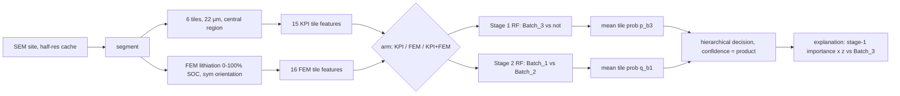

# Batch classifier: method

Results are in [`results.md`](results.md) (script-generated; regenerate with the commands in section 6). This page holds design constants only, no result numbers. FEM side: [`../fem/method.md`](../fem/method.md). Architecture decision D18: [`../../.claude/plans/fem-swelling.md`](../../.claude/plans/fem-swelling.md).

## 1. Goal

Assign each of the 3 held-out sites (`3e122cbj`, `fn0mhxef`, `xrv9xvzb`) to Batch_1, Batch_2 or Batch_3 with a confidence and an explanation of how it differs from the Batch_3 supplier baseline. Second question (ablation): do FEM swelling features add anything over the image KPIs?

## 2. Architecture



The tile grid is the FEM grid: 6 tiles of equal width between 10 µm margins (200 px at 0.1 µm) of the central region (`fem_grid_slices`). KPIs are recomputed on this grid by `pmdb/classify/kpi_tiles.py` (a copy of the `pmdb.kpis` tile loop with the slices as an argument; `pmdb/kpis` is untouched). The FEM table is read through one loader (`load_fem_tile_curves`) that knows the `tile_curves.csv` schema of `fem-build.md` section 2.1 (`sym` rows, tiles 0..5, frames 0..10).

## 3. Features

### 3a. FEM tile features (16), `sym` orientation, one tile

| feature | source metric @ frame(s) | physical meaning |
|---|---|---|
| `fem_swell_50` | `swelling` @ 5 | electrode thickness strain at 50% SOC |
| `fem_swell_100` | `swelling` @ 10 | electrode thickness strain at full charge |
| `fem_swell_slope_early` | OLS slope of `swelling` vs s, frames 0-2 | swelling rate in the Si-dominated stage (s < s* = 0.25) |
| `fem_swell_slope_late` | OLS slope of `swelling` vs s, frames 3-10 | swelling rate once graphite lithiation dominates (s > 0.25) |
| `fem_surface_rough_100` | `surface_rough` @ 10 | non-uniformity of the free-surface rise across the tile |
| `fem_pore_left_100` | `1 + porosity_rel_change` @ 10 | fraction of the initial pore area still open at full charge (pore accommodation used up) |
| `fem_pore_closed_frac_100` | `pore_closed_frac` @ 10 | fraction of pore cells collapsed (J < 0.1) at full charge |
| `fem_first_closure_s` | first s with tile `pore_closed_frac` > 0 (1.1 if never) | SOC at which the first pore is crushed (early = Si packed against pores) |
| `fem_vm_si_p95_100` | `vm_si_p95_MPa` @ 10 | peak Si von Mises stress (particle fracture driver) |
| `fem_si_yield_frac_100` | `si_yield_frac` @ 10 | fraction of Si above its lithiation-dependent yield stress |
| `fem_p_si_mean_100` | `p_si_mean_MPa` @ 10 | mean hydrostatic compression of Si (how strongly the matrix confines Si) |
| `fem_vm_binder_p95_100` | `vm_binder_p95_MPa` @ 10 | peak binder stress: proxy for Si/matrix interface load transfer (debonding risk) |
| `fem_vm_gr_p95_100` | `vm_gr_p95_MPa` @ 10 | peak graphite stress imposed by swelling Si neighbours |
| `fem_sxx_mean_100` | `sxx_mean_MPa` @ 10 | mean in-plane stress (lateral constraint; curling/delamination driver) |
| `fem_J_si_mean_100` | `J_si_mean` @ 10 | realised Si volume expansion (below the free 3.24 when confined) |
| `fem_band_vm_maxdev_100` | `band_vm_maxdev` @ 10 | through-thickness heterogeneity of stress (depth-band max deviation) |

Frame k corresponds to s = k/10. Slopes are OLS slopes (NaN if any frame in the set is NaN). `fem_first_closure_s` is derived from the tile's own `pore_closed_frac` series: no closure while frame 10 is finite gives 1.1 ("never closed"); no closure with frame 10 unconverged gives NaN. The FEM contract has no interface metric, so binder p95 von Mises is used as a proxy.

### 3b. KPI tile features (15 after the zero-variance drop)

| feature | meaning |
|---|---|
| `K01_si_frac_adm` | Si area / non-artefact area (Si loading) |
| `K02_si_density_per_1000um2` | Si objects per 1000 µm² |
| `K03_ecd_d50_um`, `K03_ecd_d90_um`, `K03_ecd_max_um` | Si particle equivalent-circle diameter median / 90th pct / max |
| `K04_agglom_frac` | share of Si area in agglomerates (clusters with ECD > 5 µm) |
| `K04_n_clusters_per_1000um2` | Si cluster count density |
| `K05_voronoi_sigma` | spread of Voronoi cell areas of Si centroids (dispersion non-uniformity) |
| `K07_R_rl`, `K07_R_csr` | nearest-neighbour index vs random labelling / CSR (< 1 clustered) |
| `K09_mst_m_norm`, `K09_mst_sigma_norm` | normalised mean / SD of minimum-spanning-tree edge lengths over Si |
| `K14_empty_p50_um`, `K14_empty_p95_um` | median / 95th pct distance to the nearest Si (Si-free pockets) |
| `K15_si_graphite_contact_frac` | share of Si boundary touching graphite |
| `K16_si_graphite_dist_median_um` | median Si-to-graphite distance (dropped if zero-variance over the labelled tiles) |

## 4. Model and evaluation

- **Random forest** (fixed, never tuned), one per stage, refitted per fold: median imputation (`keep_empty_features=True`) then `RandomForestClassifier(n_estimators=500, max_features="sqrt", min_samples_leaf=3, max_depth=None, bootstrap=True, class_weight="balanced", random_state=0, n_jobs=1)`.
- **NaN policy**: empty-phase FEM metrics, solver-failure frames and `TooFewObjects` KPI tiles are NaN and imputed with the training-fold median.
- **Stages**: stage 1 labels tiles Batch_3 vs not on all training tiles; stage 2 labels Batch_1 vs Batch_2 on training tiles of true Batch_1/Batch_2 sites only. Both score every tile of a test site.
- **Pooling and decision**: site `p_b3` and `q_b1` are plain means of tile probabilities over the 6 tiles. `P_Batch_3 = p_b3`, `P_Batch_1 = (1-p_b3) q_b1`, `P_Batch_2 = (1-p_b3)(1-q_b1)`. Decision is hierarchical: Batch_3 if `p_b3 >= 0.5`, else Batch_1 if `q_b1 >= 0.5`, else Batch_2. Confidence is the product along the chosen branch.
- **LOSO**: 31 folds, one labelled site left out (held-out sites never enter any fold). Levels: `stage1` (31 sites), `stage2` (the 14 true Batch_1/Batch_2 sites, independent of stage-1 outcome), `end_to_end` (31 sites, 3 classes). Metrics: site accuracy, balanced accuracy, macro F1, Brier (mean squared error over all class columns), balanced-accuracy bootstrap CI (1000 site resamples, seed 0, percentile 2.5/97.5). Calibration bins on confidence (end-to-end: [0,0.5) [0.5,0.7) [0.7,0.9) [0.9,1]; stage levels on max(p, 1-p): [0.5,0.7) [0.7,0.9) [0.9,1]).
- **Arms**: KPI, FEM, KPI+FEM (inner join on batch, site, tile; tile x-ranges must agree within 0.1 µm).
- **Arm selection rule** (fixed in advance): take the maximum end-to-end balanced accuracy; arms within 0.05 of it are tied; among tied arms the lowest end-to-end Brier; exact ties by the order KPI+FEM, FEM, KPI. With FEM tables absent only the KPI arm runs and the report marks the result provisional.

## 5. Held-out prediction and explanation

For every arm that ran, both stages are fitted on all 31 labelled sites' tiles (asserted: no held-out row in training) and the 3 held-out sites are predicted. The headline table and explanation use the selected arm. Explanation per site: site value = mean of its 6 tile values; Batch_3 reference = the 17 labelled Batch_3 site values (mean, SD with ddof=1); `z = (x - mean)/SD`; score = stage-1 MDI importance x |z|; the top 3 features by score are quoted with their meaning, direction and z.

## 6. Reproduce

```
python scripts/classify_batches.py kpi-tiles --jobs 8     # KPIs on the 6-tile grid -> outputs/classifier/kpi_tiles6.csv
python scripts/classify_batches.py run [--fem-tiles outputs/fem/tile_curves.csv] [--require-fem]
```

`run` writes `outputs/classifier/*` and `docs/classifier/results.md`. If `outputs/fem/tile_curves.csv` exists all three arms run; otherwise only the KPI arm. Two runs are byte-identical (no timestamps).

## 7. Limitations

- 31 labelled sites: bootstrap CIs are about +/-0.2 and differences below ~0.1 balanced accuracy are noise.
- Tiles of one site are not independent: the site is the unit, tile votes are not extra evidence.
- The hierarchical decision can give a confidence below 0.5.
- The classifier always picks one of 3 batches: a held-out site from an unseen supplier is still assigned; a large |z| versus Batch_3 is the only warning.
- MDI importance favours continuous high-variance features.
- FEM features inherit the 2D elastic, pure-Si, sym-orientation assumptions (D17, FEM method doc); binder p95 stress is only a proxy for interface stress.
- 22 µm tiles make KPIs noisier than the 44 µm grid used in check 3.
