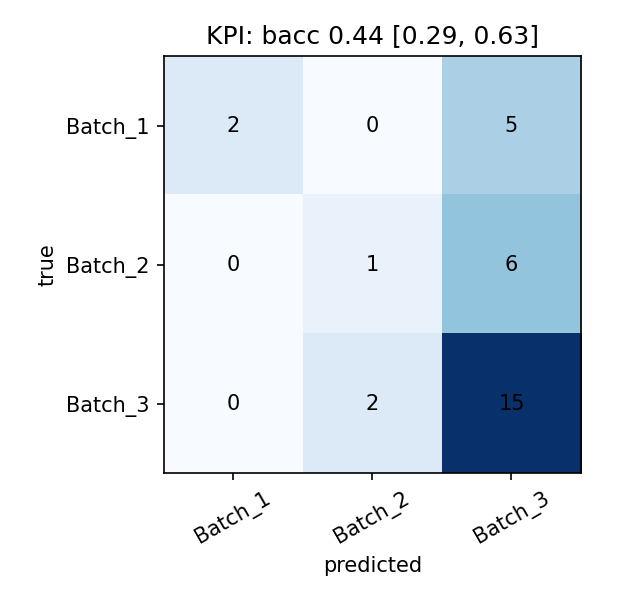
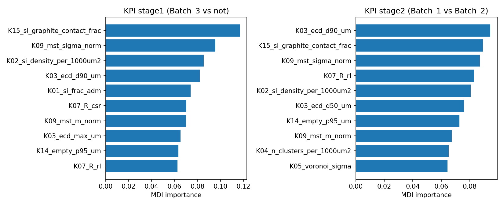

# Batch classifier: two-stage random forest vs Batch_3 (D18)

Status: provisional (FEM arms not run): KPI

## Inputs

- KPI tiles: `outputs/classifier/kpi_tiles6.csv` (md5 `962bb793d82a7ca22a455722674a5d4b`)
- FEM tiles: not available
- Arms run: KPI
- Feature counts: KPI 15
- KPI zero-variance columns dropped: K16_si_graphite_dist_median_um

## Held-out predictions (arm: KPI)

| site | predicted | confidence | p_b3 | q_b1 | n_tiles | stage1_votes_not_b3 | stage2_votes_b1 |
|---|---|---|---|---|---|---|---|
| 3e122cbj | Batch_1 | 0.855 | 0.086 | 0.935 | 6 | 6 | 6 |
| fn0mhxef | Batch_3 | 0.562 | 0.562 | 0.476 | 6 | 1 | 2 |
| xrv9xvzb | Batch_3 | 0.586 | 0.586 | 0.354 | 6 | 1 | 0 |

- 3e122cbj: assigned Batch_1 (confidence 0.85; P(Batch_3) = 0.09, P(Batch_1 | not Batch_3) = 0.94; 6/6 tiles vote not-Batch_3). Versus Batch_3: Si objects per 1000 um2 is higher (K02_si_density_per_1000um2 116 vs Batch_3 27.7 ± 10.5, z = +8.4); share of Si boundary touching graphite is lower (K15_si_graphite_contact_frac 0.566 vs Batch_3 0.738 ± 0.0294, z = -5.9); Si area / non-artefact area (Si loading) is higher (K01_si_frac_adm 0.139 vs Batch_3 0.0623 ± 0.00955, z = +8.0).
- fn0mhxef: assigned Batch_3 (confidence 0.56; P(Batch_3) = 0.56, P(Batch_1 | not Batch_3) = 0.48; 1/6 tiles vote not-Batch_3). Versus Batch_3: nearest-neighbour index vs CSR (< 1 clustered) is higher (K07_R_csr 1.06 vs Batch_3 0.976 ± 0.0582, z = +1.4); Si particle equivalent-circle diameter, 90th percentile is higher (K03_ecd_d90_um 3.22 vs Batch_3 2.83 ± 0.403, z = +1.0); normalised mean minimum-spanning-tree edge length over Si is higher (K09_mst_m_norm 2.28 vs Batch_3 2.14 ± 0.141, z = +1.0).
- xrv9xvzb: assigned Batch_3 (confidence 0.59; P(Batch_3) = 0.59, P(Batch_1 | not Batch_3) = 0.35; 1/6 tiles vote not-Batch_3). Versus Batch_3: Si area / non-artefact area (Si loading) is lower (K01_si_frac_adm 0.0518 vs Batch_3 0.0623 ± 0.00955, z = -1.1); Si particle equivalent-circle diameter, 90th percentile is lower (K03_ecd_d90_um 2.47 vs Batch_3 2.83 ± 0.403, z = -0.9); 95th percentile distance to the nearest Si (Si-free pockets) is higher (K14_empty_p95_um 7.31 vs Batch_3 5.61 ± 1.61, z = +1.1).

All arms, predicted (confidence):

| site | KPI |
|---|---|
| 3e122cbj | Batch_1 (0.85) |
| fn0mhxef | Batch_3 (0.56) |
| xrv9xvzb | Batch_3 (0.59) |

## LOSO ablation (31 labelled sites)

| arm | level | n_sites | site_acc | balanced_acc | bacc_ci_lo | bacc_ci_hi | macro_f1 | brier |
|---|---|---|---|---|---|---|---|---|
| KPI | stage1 | 31 | 0.581 | 0.548 | 0.418 | 0.702 | 0.507 | 0.233 |
| KPI | stage2 | 14 | 0.357 | 0.357 | 0.125 | 0.625 | 0.354 | 0.277 |
| KPI | end_to_end | 31 | 0.581 | 0.437 | 0.292 | 0.630 | 0.447 | 0.191 |

Arm selection rule (fixed before FEM results): take the maximum end-to-end LOSO balanced accuracy; arms within 0.05 of it are tied; among tied arms the lowest end-to-end Brier wins; exact Brier ties go by the order KPI+FEM, FEM, KPI. If FEM tables are absent only the KPI arm runs and the result is provisional.

Applied: selected arm = **KPI**.

End-to-end confusion (KPI, rows true, columns predicted):

| true | Batch_1 | Batch_2 | Batch_3 |
|---|---|---|---|
| Batch_1 | 2 | 0 | 5 |
| Batch_2 | 0 | 1 | 6 |
| Batch_3 | 0 | 2 | 15 |

## Calibration

| level | bin | n | mean_conf | accuracy |
|---|---|---|---|---|
| stage1 | [0.5,0.7) | 29 | 0.567 | 0.552 |
| stage1 | [0.7,0.9) | 2 | 0.802 | 1.000 |
| stage1 | [0.9,1.0] | 0 |  |  |
| stage2 | [0.5,0.7) | 12 | 0.589 | 0.250 |
| stage2 | [0.7,0.9) | 2 | 0.824 | 1.000 |
| stage2 | [0.9,1.0] | 0 |  |  |
| end_to_end | [0.0,0.5) | 3 | 0.295 | 0.333 |
| end_to_end | [0.5,0.7) | 28 | 0.576 | 0.607 |
| end_to_end | [0.7,0.9) | 0 |  |  |
| end_to_end | [0.9,1.0] | 0 |  |  |

Top-5 MDI importance per stage (KPI):

| stage | rank | feature | importance |
|---|---|---|---|
| stage1 | 1 | K15_si_graphite_contact_frac | 0.117 |
| stage1 | 2 | K09_mst_sigma_norm | 0.096 |
| stage1 | 3 | K02_si_density_per_1000um2 | 0.085 |
| stage1 | 4 | K03_ecd_d90_um | 0.082 |
| stage1 | 5 | K01_si_frac_adm | 0.074 |
| stage2 | 1 | K03_ecd_d90_um | 0.094 |
| stage2 | 2 | K15_si_graphite_contact_frac | 0.089 |
| stage2 | 3 | K09_mst_sigma_norm | 0.087 |
| stage2 | 4 | K07_R_rl | 0.083 |
| stage2 | 5 | K02_si_density_per_1000um2 | 0.081 |

## External reference (check 3, not an arm)

| rule | task | balanced_acc | bacc_ci_lo | bacc_ci_hi |
|---|---|---|---|---|
| R1_mean_prob | multiclass | 0.493 | 0.316 | 0.691 |
| R4_site_kpis | multiclass | 0.493 | 0.309 | 0.683 |

Flat logistic on 4-tile KPIs; not the same task structure.

Caveat: 31 labelled sites: differences below ~0.1 balanced accuracy are within the bootstrap CI.
