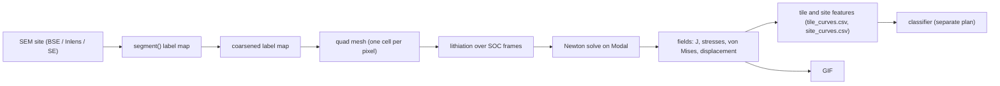

# FEM lithiation-swelling simulation: method

This document describes how each SEM cross-section is turned into a finite-element mesh, lithiated, solved and reduced to batch-discriminating features. Every parameter value, result, cost and threshold below sits inside a generated block; the prose around the blocks contains no numbers. Regenerate the blocks with `python scripts/fem_docs.py --method`.

## 1. Pipeline

- SEM site to label map: `pmdb.segment` segments the un-harmonised BSE image with the same rule as the KPI pipeline (D4, P24).
- Label map to coarsened label map: `pmdb.fem.geometry` coarsens by a majority vote with a fixed phase priority, so thin pores and rare Si survive.
- Coarsened label map to mesh and lithiation: `pmdb.fem.solver` builds one quadrilateral cell per pixel and assigns per-phase eigenstretches and moduli from `pmdb.fem.materials` at each SOC step.
- Mesh to fields: `pmdb.fem.solver` runs the load-stepped Newton solve with a direct linear solver; `modal_fem.py` runs it in the pinned dolfinx image on Modal.
- Fields to features: `pmdb.fem.features` reduces the fields on a fixed tile grid and for the central site region.
- Fields to GIF: `pmdb.fem.gif` warps the BSE image by the displacement and overlays the von Mises stress on solid cells.

## 2. Physics assumptions

The model is plane strain with finite-strain kinematics. The total deformation gradient is split multiplicatively into an elastic part and an eigenstretch (lithiation) part. Silicon swells isotropically, graphite swells anisotropically with its c-axis along the thickness direction, and binder, pores and segmentation artefacts do not swell. Lithiation is uniform within each phase at a given SOC. The material response is elastic only; the silicon yield stress is evaluated as a flag and does not enter the solve. Pores are modelled as an ersatz soft material, which is a numerical choice rather than a measured property.

<!-- AUTO:physics -->
| Assumption | Model choice | Source | Evidence strength |
|---|---|---|---|
| Kinematics | F = Fe·Fλ (no Fvp in v1); Fλ_Si = J_λ^(1/3)·I | R5:E8, R5:E9 (Shah eqs. 3, 5, 6); P:C1 (R3:E7, E8) | verbatim |
| Elastic energy (all phases) | W = μ/2(I1(Ce) − 3) − μ ln Je + λ/2 (ln Je)², with I1 from the 3D Ce (plane strain: the out-of-plane total stretch is 1, so Ce33 = 1/λ_y²) | R5:E13 (Shah eq. 13, inactive phases); P:C3 (R3:E17, E18 FEniCSx demos) | verbatim |
| Graphite orientation | c ∥ z (flakes parallel to the collector) | R4:E25 (CT: "alignment of the platelet particles … caused by packing ordering and calendering"); R4:E27, R4:E28 (flakes lie preferentially parallel to the collector) | verbatim qualitative (E25); tool-summary (E27, E28); degree unsupported |
| Out-of-plane | Plane strain (user D2) | P:V3 (substrate in-plane constraint); Shah used axisymmetric (R5:E2, R5:E3) | unsupported directly |
| Current-collector edge | u_z = 0; run both orientations because the foil side is unknown | R5:E18 (Shah: u·n = 0 at z = 0) | verbatim (analogue) |
| Lateral edges | u_x = 0 | R5:E18 (Shah: u·n = 0 at r = R0); P:V3 | verbatim (analogue) |
| Separator-side edge | Traction-free | R3:E10 via P:C19; R4:E9 (about 1 MPa peak); R5:E18 (Shah fixes z = L) | verbatim |
<!-- /AUTO:physics -->

## 3. Parameters

<!-- AUTO:params -->
Sources: [literature review, parameter table](literature-review.md#1-final-parameter-table)

| Parameter | Value used | Source | Evidence strength |
|---|---|---|---|
| Si volumetric eigenstretch | si.beta = 2.8 | P:V1 (Qi 263%); R4:E18 (Obrovac 277%, quoted by Kirner); R1:E2 (Beaulieu 280%); R5:E16 (Shah ΩCmax = 8.1872e-6 × 3.6643e5 = 3.00); R4:E2 | verbatim (263, 277, linear-in-C form); tool-summary (280) |
| Si utilisation at 100% overall SOC, u_max | soc.u_max = 0.8 | R4:E2 (3400 mAh g⁻¹ at 0.01 V; 3400/3578 = 0.95, with 3578 = 2.920 mAh/0.816 mg from R4:E5); R4:E10 (full-cell anode minimum about 0.1 V, "Li3.75Si is hard to be reached"); R5:E24 (235% at a 0.1 V cut-off, which is u ≈ 0.84 at β = 2.8) | verbatim bounds; default derived |
| Graphite lithiation at 100% overall SOC, y_max | soc.y_max = 0.91 | R4:E2 (340 of 372 mAh g⁻¹ at 0.01 V, half cell) | verbatim at 0.01 V; full-cell value unsupported |
| Overall SOC → per-phase normalised fraction | soc.s_star = 0.25, soc.si_ratio = [0.96, 0.58], soc.gr_ratio = [0.04, 0.42] | R4:E1, R4:E2, R4:E5; V2 | verbatim inputs; function derived |
| Si E(u) | si.E_MPa = [96000.0, -55000.0] | P:V1 (Qi Table II, Shenoy); R5:E16 (Shah Table 1, citing de Vasconcelos 2020); V1 | verbatim |
| Si ν(u) | si.nu = [0.29, -0.04] | P:V1 | verbatim |
| Si yield (flag only, v1 is elastic) | si.yield_MPa = [3000.0, 3150.0], si.x_per_u = 3.75 | R5:E16, V1 (Shah Table 1, citing [20]); R5:E29 ([77] gives 1 GPa) | verbatim (the definition of x is ambiguous, see Contradictions) |
| Graphite c-axis strain ε_zz(y) | graphite.eps_c_points = [[0.0, 0.0], [0.25, 0.055], [0.5, 0.055], [1.0, 0.103]] | P:C14 (P:V2 Yao d-spacings; P:V4 Tardif d0 = 3.355 Å, about 10%) | verbatim inputs; breakpoints derived |
| Graphite a-axis strain ε_xx(y) | graphite.eps_a_over_c = [0.01, 0.103] | P:C15 (R2:E1 13.2% volume; P:V1 10%) | tool-summary plus verbatim (derived) |
| Graphite E, ν (isotropic) | graphite.E_MPa = [32000.0, 77000.0], graphite.nu = [0.32, -0.08] | P:V1 (Qi Table II Reuss) | verbatim |
| Binder + CBD (unassigned solid) | binder.E_MPa = 500.0, binder.nu = 0.34 | P:C18 (R2:E5); R4:E7 (Nadimpalli Table 2 has no PVdF row) | tool-summary |
| Pore / artefact | pore.E_rel_binder = 0.0001, pore.nu = 0.3, pore.closure_J = 0.1 | None. Shah states no pore stiffness either (R5 Not found) | unsupported |
| Resolution | mesh.res_nm = 100.0 | None | unsupported |
<!-- /AUTO:params -->

## 4. Boundary conditions

The current-collector edge is fixed in the thickness direction. Both lateral edges are rollers that fix the in-plane horizontal displacement. The separator-side edge is traction-free. The side of the foil is not visible in the images, so every site is simulated with the collector at the bottom of the image and again with the collector at the top; the `sym` feature set is the mean of the two (P10, P17). The mean is invariant to a vertical flip of the image, so the features cannot encode an arbitrary orientation guess.

## 5. SOC mapping

The overall state of charge is split between silicon and graphite with a two-region (Yao) function, whose breakpoint marks the end of the first plateau. Each component has a normalised lithiation fraction that reaches unity at full charge; these are scaled by the utilisation of each component. Graphite strain follows a piecewise-linear staging curve, and the in-plane graphite strain is a fixed fraction of the c-axis strain.

<!-- AUTO:soc -->
| s | f_Si | f_Gr | u | y | J_Si | ε_c |
|---|---|---|---|---|---|---|
| 0.0 | 0.000 | 0.000 | 0.000 | 0.000 | 1.000 | 0.000 |
| 0.1 | 0.142 | 0.012 | 0.114 | 0.011 | 1.319 | 0.002 |
| 0.2 | 0.284 | 0.025 | 0.228 | 0.022 | 1.637 | 0.005 |
| 0.3 | 0.399 | 0.095 | 0.319 | 0.087 | 1.893 | 0.019 |
| 0.4 | 0.484 | 0.225 | 0.388 | 0.204 | 2.085 | 0.045 |
| 0.5 | 0.570 | 0.354 | 0.456 | 0.322 | 2.278 | 0.055 |
| 0.6 | 0.656 | 0.483 | 0.525 | 0.440 | 2.470 | 0.055 |
| 0.7 | 0.742 | 0.612 | 0.594 | 0.557 | 2.663 | 0.060 |
| 0.8 | 0.828 | 0.742 | 0.663 | 0.675 | 2.855 | 0.072 |
| 0.9 | 0.914 | 0.871 | 0.731 | 0.792 | 3.048 | 0.083 |
| 1.0 | 1.000 | 1.000 | 0.800 | 0.910 | 3.240 | 0.094 |
<!-- /AUTO:soc -->

## 6. Features and output tables

Features are computed per region and per SOC frame. The regions are six non-overlapping full-height tiles with fixed edges that exclude the lateral boundary bands (P15); the site region is the union of the tiles. Three tiers are built (P16): tier 1 holds named scalar metrics (surface swelling and roughness, mean stresses, porosity and its change, phase-mean stretch, von Mises percentiles, silicon yield fraction, closed-pore fraction); tier 3 holds quantiles of von Mises stress, pressure and the volume ratio over silicon, graphite and binder, plus the volume ratio over pores; tier 4 holds depth-band summaries of von Mises stress and the volume ratio over solid cells. Per-particle features are not built.

The output tables are `outputs/fem/site_curves.csv` and `outputs/fem/tile_curves.csv`. Key and metadata columns: `batch`, `site`, `heldout`, `orientation`, `tile` (tile table only), `tile_x0_um` and `tile_x1_um` (tile table only), `frame`, `s`, `converged`, `failed_at_s`, `first_pore_closure_s`. Tier 1 columns: `swelling`, `surface_rough`, `sxx_mean_MPa`, `syy_mean_MPa`, `porosity`, `porosity_change`, `porosity_rel_change`, `J_si_mean`, `J_gr_mean`, `J_binder_mean`, `vm_si_p50_MPa`, `vm_si_p95_MPa`, `vm_gr_p95_MPa`, `vm_binder_p95_MPa`, `p_si_mean_MPa`, `si_yield_frac`, `pore_closed_frac`. Tier 3 columns: `q{quantile}_{field}_{phase}` for the fields `vm`, `p`, `J` and the phases `si`, `gr`, `binder`, and `q{quantile}_J_pore`. Tier 4 columns: `band_vm_maxdev`, `band_vm_absslope`, `band_J_maxdev`, `band_J_absslope`.

## 7. Validation gates

The stop window is the range outside of which a swelling result is treated as a bug; the literature band is reported only. G1 is the analytic solver and unit test suite. G2 is the resolution check against the native-resolution mesh. G4 is the production median swelling against the stop window. G5 limits the number of sites whose solve fails before full charge. Under the fix-and-continue policy (P25) a failed gate is escalated for a fix round and the run continues; non-convergence is handled by a remediation ladder applied once, before production, so that all sites share one physics configuration.

<!-- AUTO:gates -->
- Stop window for the site swelling at full SOC: [0.03, 0.39]
- Literature band (reported only): [0.09, 0.39]
- Maximum sites with a failed solve: 3
- Solver settings: `ds_max` = 0.05, `ds_min` = 0.0015625, `grow_if_its_le` = 5, `snes_rtol` = 1e-08, `snes_atol` = 1e-10, `snes_max_it` = 25, `quadrature_degree` = 2, `linesearch` = bt
- Remediation applied: none applied
<!-- /AUTO:gates -->

## 8. Runtime and cost

All finite-element code runs on Modal in a pinned container image. Production runs are detached and polled from the results volume; each case is retried once with a larger timeout and memory. Before every launch the remaining planned spend is re-projected against the hard cap; if it would exceed the cap the collector-at-top orientation is dropped first, then the resolution check.

<!-- AUTO:cost -->
_pending: generated after the full run_
<!-- /AUTO:cost -->

## 9. Limitations

- Two-dimensional plane strain; no out-of-plane variation.
- No electrochemistry or rate effects; the state of charge is imposed uniformly per phase.
- Elastic only; plasticity and fracture are not modelled.
- No particle rearrangement, binder creep or SEI growth, so electrode swelling is expected to sit below measured values.
- The collector side is unknown, hence the `sym` feature set.
- Pure-silicon assumption; a silicon-oxide variant was not run (D17).
- Parameter robustness was not measured; sweeps were dropped (D17).
- Pore stiffness is a numerical choice without a source.
