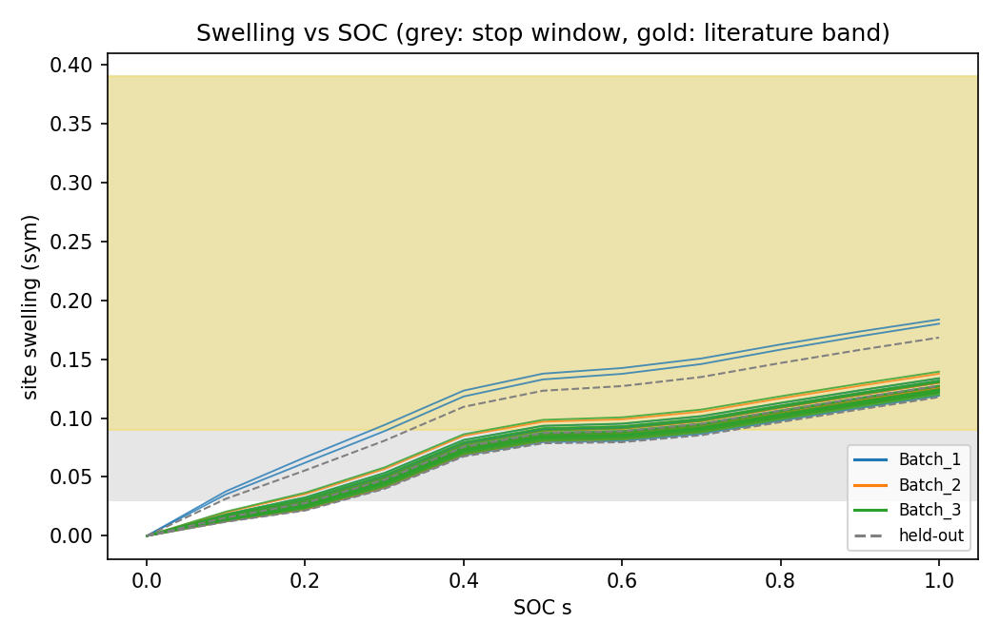
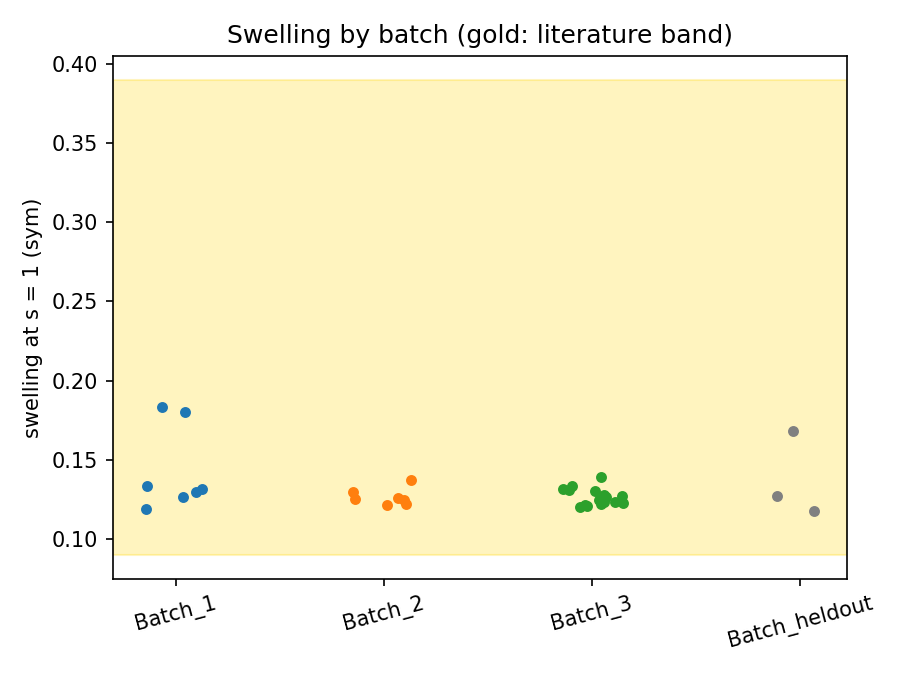
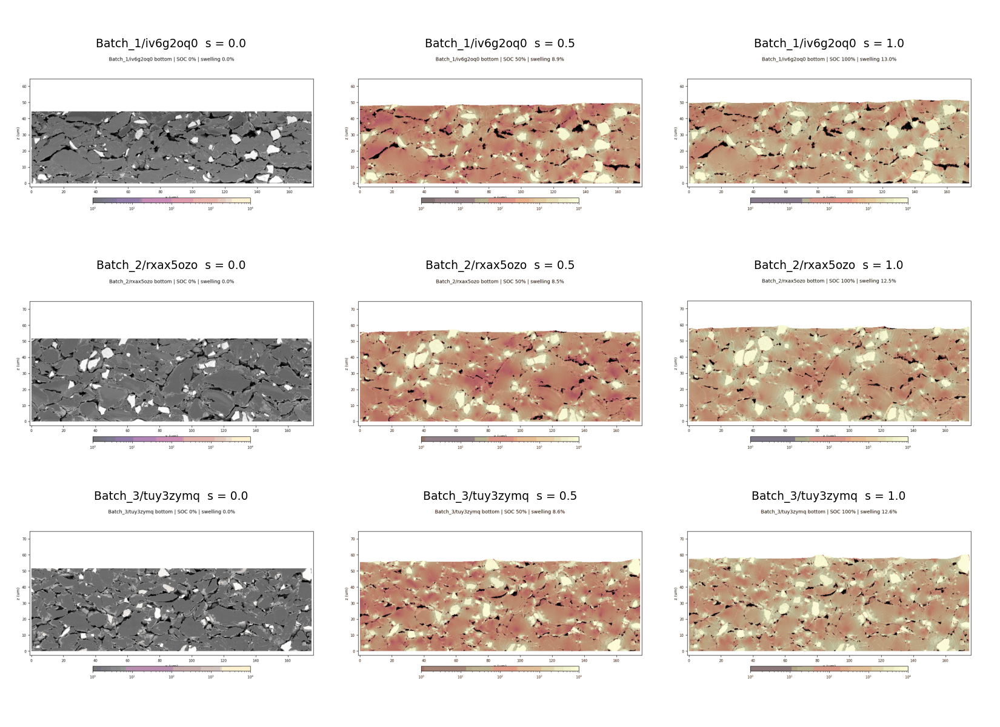

# FEM lithiation-swelling simulation: results

Generated blocks below are filled by `python scripts/fem_docs.py --method --results` from `outputs/fem/`. Method and parameters: [method.md](method.md).

## Flags

<!-- AUTO:flags -->
- remediation applied: rung1: solver.ds_min 0.0015625 -> 0.0001953125 (stage3 failed_at_s bottom=0.0265625, top=0.0265625; old solver, predictor NaN)
- remediation applied: P30: pore compaction barrier psi_c = kappa/2 ln(J/Jc)^2 for J < Jc, Jc 0.3, kappa 500 MPa, pore cells only (rungs 1-3 reached s <= 0.075 only; pores crushed to J -> 0; P30 made it worse, finite path only)
- remediation applied: P31/D20: mechanics linear (small strain, log eigenstrain), no substepping
<!-- /AUTO:flags -->

## Validation

<!-- AUTO:validation -->
- G1: 49 passed in 38.56s
- G2 (100 vs 50 nm, max relative difference over s = 0.5 and 1.0): J_si_mean_minus_1 0.00802, porosity_change 0.0649, swelling 0.00643, sxx_mean_MPa 0.0155, vm_si_p50_MPa 0.0102, vm_si_p95_MPa 0.0136; verdict pass
- Median swelling_sym at s = 1 over 34 sites: 0.127 (stop window [0.03, 0.39] -> G4 pass; literature band [0.09, 0.39] lit_band_ok = True)
- Median swelling_sym by batch: Batch_1 0.132, Batch_2 0.125, Batch_3 0.125, Batch_heldout 0.127
- Median sxx_mean/(-10) (VT2, MPa scale) by batch: Batch_1 299, Batch_2 278, Batch_3 285, Batch_heldout 280
- Median porosity_change (VT4) by batch: Batch_1 -0.00482, Batch_2 -0.00567, Batch_3 -0.00529, Batch_heldout -0.00655
- Median porosity_rel_change (VT4) by batch: Batch_1 -0.121, Batch_2 -0.156, Batch_3 -0.13, Batch_heldout -0.173
- Median J_si_mean (VT5) by batch: Batch_1 1.7, Batch_2 1.69, Batch_3 1.67, Batch_heldout 1.69
- Sites outside the stop window: none
- Absolute stresses are not physical under the linear small-strain model (see Limitations).
<!-- /AUTO:validation -->

## Limitations

- **Production mechanics is linear small-strain elasticity with a logarithmic eigenstrain (decision D20 / P31), not finite strain.** The finite-strain compressible neo-Hookean solver (kept in `pmdb/fem/solver.py` and covered by its unit tests) could not reach full SOC on real segmentations. Evidence from the Step 7 debugging (`.claude/reports/fem-build.implementer-s7.md`): (i) Newton failed at s of about 0.02 to 0.08 for every ladder rung (smaller `ds_min`, stiffer pores, basic line search, 100 Newton iterations), with reason -5/-6 and a non-convergent basin rather than slow convergence; (ii) the soft-void pores (E = 1e-4 of the binder) have no stiffness until J approaches 0, and Si volume growth (stretch volume factor up to about 3.2) crushes neighbouring pores to J of order 1e-3 within a few percent SOC; (iii) a pore compaction barrier (P30; Jc 0.3 / kappa 500 MPa, then 0.5 / 5000 MPa) made convergence worse (failed at s = 0.023 and 0.016), consistent with Newton cycling at the barrier kink. The finite path was therefore abandoned for production.
- **Absolute Si stresses are not physical.** With a 3.2x volume eigenstrain applied linearly, Si von Mises stresses saturate at about 20 to 26 GPa (median and p95) and `si_yield_frac` is 1.0 everywhere. Stress-derived features (`sxx_*`, `vm_*`, `p_*`, the `q*_vm_*` and `q*_p_*` quantiles, the band features on vm) are therefore relative and weak descriptors of the microstructure, not stress predictions. The GIF von Mises colour scale (1 to 1e4 MPa) is saturated in Si.
- **`J` is a linear measure** (`J = 1 + eps_xx + eps_zz`) and can be at or below zero in pores: this is over-closure of a pore under linear kinematics, caught by the pore-closure flag (`first_pore_closure_s`, `pore_closed_frac`) rather than a solver failure. `J_si_mean` is not comparable with the free-expansion finite-strain value.
- Swelling (site-surface rise), porosity change and geometry-driven features are less affected by the stress saturation, and the swelling gate (G4) is evaluated on those.
- A resolution check (100 vs 50 nm, G2) was run on a 20 um window of one Batch 3 site only.

## Convergence

<!-- AUTO:convergence -->
- bottom: 34 cases, 0 with failed_at_s < 1; n_substeps median 11 max 11; newton_its_total median 11 max 11; wall_s median 140 max 191
- top: 34 cases, 0 with failed_at_s < 1; n_substeps median 11 max 11; newton_its_total median 11 max 11; wall_s median 130 max 175
- G5: 0 sites with failed_at_s < 1 in either orientation (max 3) -> pass
- Failed sites: none
- Production mechanics is linear (one solve per frame); `n_substeps` counts those solves.
<!-- /AUTO:convergence -->

## Cost

<!-- AUTO:cost -->
- Ledger total: $2.608 of the $180 cap
- Per-mode subtotals (USD): bench 0.08, diag 0.57, full 1.31, orchestrator 0.03, probe 0.01, unit 0.06, window 0.54
- Production per-case cost (USD): median 0.019, max 0.023
<!-- /AUTO:cost -->

## Figures and GIFs

<!-- AUTO:figures -->

GIFs (bottom orientation):

- [Batch_1/4ih2ggld](../../outputs/fem/gifs/Batch_1__4ih2ggld.gif)
- [Batch_1/5n1q8atc](../../outputs/fem/gifs/Batch_1__5n1q8atc.gif)
- [Batch_1/f1vzngrs](../../outputs/fem/gifs/Batch_1__f1vzngrs.gif)
- [Batch_1/ffwubibz](../../outputs/fem/gifs/Batch_1__ffwubibz.gif)
- [Batch_1/fzrt2k6r](../../outputs/fem/gifs/Batch_1__fzrt2k6r.gif)
- [Batch_1/iv6g2oq0](../../outputs/fem/gifs/Batch_1__iv6g2oq0.gif)
- [Batch_1/uhdslk0o](../../outputs/fem/gifs/Batch_1__uhdslk0o.gif)
- [Batch_2/3806gxp0](../../outputs/fem/gifs/Batch_2__3806gxp0.gif)
- [Batch_2/avn74qx1](../../outputs/fem/gifs/Batch_2__avn74qx1.gif)
- [Batch_2/b3esycq1](../../outputs/fem/gifs/Batch_2__b3esycq1.gif)
- [Batch_2/epqdaau9](../../outputs/fem/gifs/Batch_2__epqdaau9.gif)
- [Batch_2/i9jiqjwl](../../outputs/fem/gifs/Batch_2__i9jiqjwl.gif)
- [Batch_2/r17byphk](../../outputs/fem/gifs/Batch_2__r17byphk.gif)
- [Batch_2/rxax5ozo](../../outputs/fem/gifs/Batch_2__rxax5ozo.gif)
- [Batch_3/0grcilhi](../../outputs/fem/gifs/Batch_3__0grcilhi.gif)
- [Batch_3/71vgq3fw](../../outputs/fem/gifs/Batch_3__71vgq3fw.gif)
- [Batch_3/9luzk4jm](../../outputs/fem/gifs/Batch_3__9luzk4jm.gif)
- [Batch_3/cfe5vt7s](../../outputs/fem/gifs/Batch_3__cfe5vt7s.gif)
- [Batch_3/hawkfj64](../../outputs/fem/gifs/Batch_3__hawkfj64.gif)
- [Batch_3/hzumfsms](../../outputs/fem/gifs/Batch_3__hzumfsms.gif)
- [Batch_3/kbdh4tri](../../outputs/fem/gifs/Batch_3__kbdh4tri.gif)
- [Batch_3/mgxahqnk](../../outputs/fem/gifs/Batch_3__mgxahqnk.gif)
- [Batch_3/pl8uabbv](../../outputs/fem/gifs/Batch_3__pl8uabbv.gif)
- [Batch_3/ptg8lmto](../../outputs/fem/gifs/Batch_3__ptg8lmto.gif)
- [Batch_3/tuy3zymq](../../outputs/fem/gifs/Batch_3__tuy3zymq.gif)
- [Batch_3/ufdvpb81](../../outputs/fem/gifs/Batch_3__ufdvpb81.gif)
- [Batch_3/utfgcjfa](../../outputs/fem/gifs/Batch_3__utfgcjfa.gif)
- [Batch_3/vc2whyaq](../../outputs/fem/gifs/Batch_3__vc2whyaq.gif)
- [Batch_3/x77cy643](../../outputs/fem/gifs/Batch_3__x77cy643.gif)
- [Batch_3/x7u69zsw](../../outputs/fem/gifs/Batch_3__x7u69zsw.gif)
- [Batch_3/xgj4xftb](../../outputs/fem/gifs/Batch_3__xgj4xftb.gif)
- [Batch_heldout/3e122cbj](../../outputs/fem/gifs/Batch_heldout__3e122cbj.gif)
- [Batch_heldout/fn0mhxef](../../outputs/fem/gifs/Batch_heldout__fn0mhxef.gif)
- [Batch_heldout/xrv9xvzb](../../outputs/fem/gifs/Batch_heldout__xrv9xvzb.gif)
<!-- /AUTO:figures -->

## Batch differences

<!-- AUTO:batch_diff -->
Descriptive, unadjusted, 31 sites. Kruskal-Wallis across Batch_1/2/3 on the 81 site metrics at s = 1 (orientation sym), top 8 by H.

| metric | median B1 | median B2 | median B3 | H | p |
|---|---|---|---|---|---|
| q5_vm_si | 1.307e+04 | 1.304e+04 | 1.273e+04 | 13.73 | 0.00104 |
| q25_vm_si | 1.555e+04 | 1.512e+04 | 1.473e+04 | 12.37 | 0.00206 |
| q25_p_si | 1.486e+04 | 1.565e+04 | 1.669e+04 | 9.103 | 0.0106 |
| q75_J_si | 1.761 | 1.739 | 1.709 | 9.103 | 0.0106 |
| J_si_mean | 1.701 | 1.687 | 1.672 | 8.752 | 0.0126 |
| p_si_mean_MPa | 1.7e+04 | 1.75e+04 | 1.803e+04 | 8.752 | 0.0126 |
| vm_si_p50_MPa | 1.784e+04 | 1.776e+04 | 1.713e+04 | 8.669 | 0.0131 |
| q50_vm_si | 1.784e+04 | 1.776e+04 | 1.713e+04 | 8.669 | 0.0131 |
<!-- /AUTO:batch_diff -->

See [method.md](method.md) for the model, parameters and gates.
