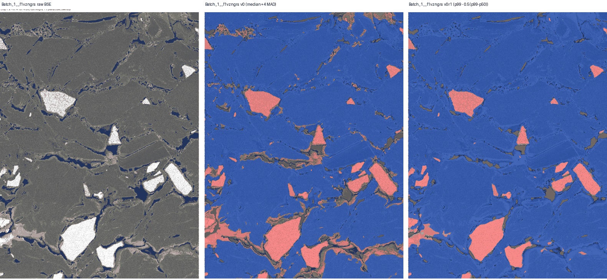
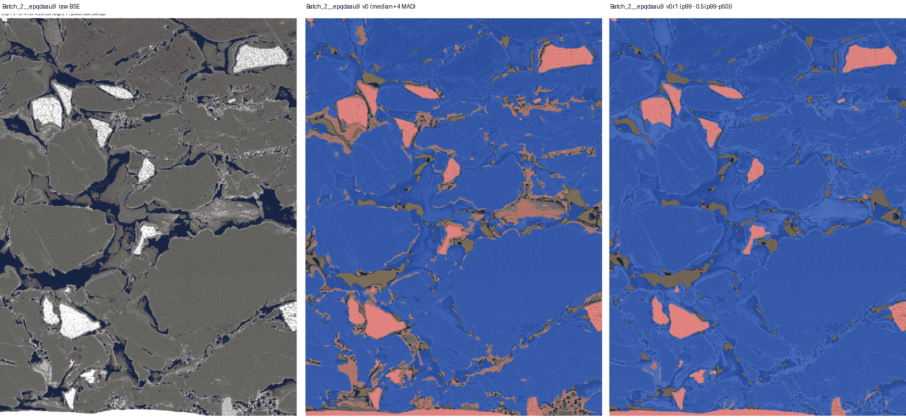
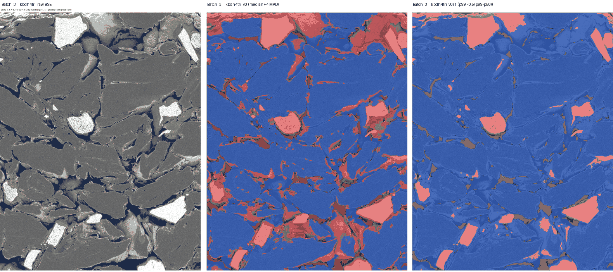

# Segmentation v0 notes

## Final rule

The production segmenter is **v0r1**, the single global revision permitted by D-011. It still uses
un-normalised half-resolution BSE, Gaussian smoothing (sigma 1 px), the locked pore threshold,
closing/fill/small-object filtering, graphite opening and artefact filtering. Only the Si threshold changed:

```text
v0:   T_si = median_solid + 4 * MAD_solid
v0r1: T_si = p99 - 0.5 * (p99 - p50)
```

The constants are global. No batch identity or per-site value enters the rule.

## Why the revision was used

In all three batches, v0 labelled binder/carbon black and bright graphite edges as Si. It failed the
synthetic known-answer test at Si IoU 0.80 (required >0.85). The bright-anchored threshold visibly
reduced the common false-positive mode and passed the same test at Si IoU 0.95. Pore IoU is 0.89.

Representative full-height crops (raw, v0, v0r1):







## Overlay review

All 31 final overlays were reviewed as contact sheets and representative full-resolution crops. Bright
Si-rich grains are selected consistently across batches; the former widespread binder/edge selection is
substantially reduced. No site has a gross site-specific failure requiring tuning. Residual thin red rims
at some bright graphite boundaries occur across batches and are a known limitation of this provisional
intensity-only segmenter, not a site-specific correction target.

**Sites whose overlays look wrong:** none grossly. The common residual rim limitation applies to all sites.

Every PNG includes a full-slice thumbnail and a full-height 40 um crop and is below 1 MB.

## K01 ranges

K01 uses the approved non-artefact slice denominator (graphite included), while admissible space remains
`~graphite & ~artefact` for point-pattern null placement. Final ranges:

| Batch | Sites | min K01 | max K01 |
|---|---:|---:|---:|
| Batch 1 | 7 | 0.0477 | 0.1645 |
| Batch 2 | 7 | 0.0437 | 0.0837 |
| Batch 3 | 17 | 0.0463 | 0.0892 |

All 31 sites satisfy the 0.1%-50% sanity range.
