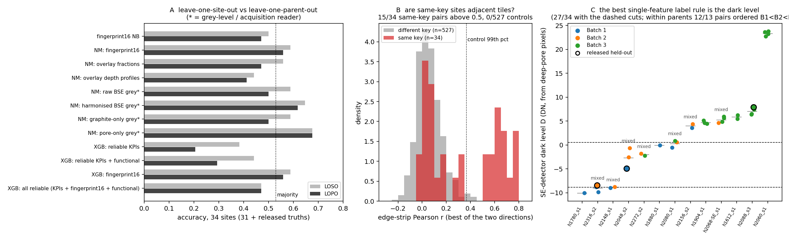

# Parent images: what the tiling does to every result, and what the labels follow

*Supplementary session, 2026-10-04, after `origin/main` landed `outputs/parent_groups.csv` and the
parent-aware patch-MIL menu (`docs/patch_mil.md`). Scripts: `scripts/run_parent_overlap.py`,
`scripts/run_lopo_rescore.py`, `scripts/run_label_feature_hunt.py`, `scripts/plot_parents.py`;
outputs under `outputs/parents/`; figure `docs/figures/parents.png`.*

## 0. In one paragraph

The 31 labelled fields (and the 3 released held-out fields) are crops of 13 wider electrode images,
and the pixels confirm it: edge-strip correlation finds 15 pairs of same-key sites that are *adjacent,
non-overlapping tiles* (r 0.54–0.79; 0 of 527 cross-key control pairs reach 0.45). Several parents hold
tiles from two or three batches, and adjacent tiles of one image carry different labels
(`5n1q8atc (B1) – 3e122cbj (B2) – 4ih2ggld (B1)`; `cfe5vt7s (B3) – r17byphk (B2) – ffwubibz (B1)`). An
electrode cannot change supplier batch every 100 µm, so the label is a per-crop quantity. Re-scoring every
family on this branch with parents held out together shows the arrangement fingerprint was *not* inflated
by sibling leakage on the 31 fields (0.677 either way) but is specific to them (0.47 once the three truths
join), the graphite-grey "microscope reader" *was* reading the parent (0.74 → 0.58), and KPI-based trees
fall below chance when a new parent appears (0.16). The one quantity that survives every split is the
pore-floor grey level. Hunting the organiser's crop feature over 246 scalars, the best single two-cutpoint
rule for the 34 labels is the SE-detector dark level (B1 < B2 < B3, 27/34, max-statistic p 0.009), and the
same quantity orders the labels within parents in 12 of 13 pairs — suggestive but not significant after
paying for the search (13 pairs cannot single out one feature among 246). No morphological KPI competes.
The batches, between and within parent images, track how bright the pore floors are, not how the
material is arranged.

## 1. Are the parent groups real? (`run_parent_overlap.py`, `outputs/parents/overlap_summary.md`)

`pmdb/parents.py` infers a parent from (full-resolution height, SE detector, BSE grey step). That is a
metadata coincidence until the pixels agree. For every pair of the 34 sites (561 pairs; 34 same-key, 527
different-key) on 4×-downsampled half-resolution BSE:

| statistic | same key (median, max) | different key (median, 99th pct, max) |
|---|---|---|
| zero-padded phase-correlation peak-to-sidelobe | 12.9, 16.0 | 12.5, 15.2, 16.4 |
| edge-strip Pearson r (4-column means, best direction) | 0.31, 0.79 | 0.05, 0.37, 0.44 |

Phase correlation finds nothing: no same-key pair shares pixels, so the crops do not overlap. The edge test
does: 15 of 34 same-key pairs have the right edge of one tile correlated with the left edge of the other
at r > 0.5 (a 200-random-column null per pair tops out at 0.25), and 0 of 527 control pairs do. The
correlation is not ≈ 1 because 4 border columns were cropped from every side (`AGENTS.md`), so the strips
compared are 16 full-resolution columns ≈ 400 nm apart.

Reconstructed order along x (`outputs/parents/chains.md`; `|` = adjacency not detected, a gap or a
missing tile; `weak` = r above the null but below 0.5):

- `h1612_s1`: ptg8lmto (3) | xgj4xftb (3)
- `h1904_s1`: mgxahqnk (3) – hawkfj64 (3) –weak– 0grcilhi (3)
- `h2048_s2`: avn74qx1 (2) | **fn0mhxef (1) – 3806gxp0 (2)**
- `h2060_s1`: x7u69zsw (3) –weak– tuy3zymq (3) – kbdh4tri (3) – 71vgq3fw (3)
- `h2068_SE_s1`: vc2whyaq (3) – x77cy643 (3) – utfgcjfa (3) – **rxax5ozo (2)**
- `h2080_s1`: **cfe5vt7s (3) – r17byphk (2) – ffwubibz (1)**
- `h2088_s3`: ufdvpb81 (3) – xrv9xvzb (3) – 9luzk4jm (3) – hzumfsms (3)
- `h2148_s1`: **f1vzngrs (1) – epqdaau9 (2)**
- `h2156_s2`: fzrt2k6r (1) | b3esycq1 (2)
- `h2272_s2`: i9jiqjwl (2) | pl8uabbv (3)
- `h2316_s2`: **5n1q8atc (1) – 3e122cbj (2) – 4ih2ggld (1)**

Seven parents are single-batch (all Batch 3 except two singleton Batch 1 parents); six are mixed, and in
the mixed ones the label changes between physically adjacent tiles with no left-to-right order. So the
parent key is confirmed as a grouping variable, and the labels are confirmed to be per-crop.

## 2. What leave-one-parent-out does to this branch (`run_lopo_rescore.py`, `outputs/parents/lopo_rescore.md`)

Every family on this branch, re-run with the same code under leave-one-site-out (LOSO) and
leave-one-parent-out (LOPO). Permutation p: labels shuffled, parent groups fixed. Majority class 0.548
(31) / 0.529 (34).

| method (34 sites = 31 + released truths) | LOSO acc (p) | LOPO acc (p) | LOPO recall B1/B2/B3 |
|---|---|---|---|
| fingerprint16 naive Bayes | 0.500 (0.076) | 0.471 (0.100) | 0.50/0.25/0.56 |
| nearest mean: overlay fractions (material) | 0.559 (0.032) | 0.471 (0.144) | 0.00/0.25/0.78 |
| nearest mean: overlay depth profiles (material) | 0.441 | 0.412 | 0.50/0.38/0.39 |
| nearest mean: raw BSE grey (acquisition) | 0.588 (0.028) | 0.500 (0.110) | 0.38/0.38/0.61 |
| nearest mean: harmonised BSE grey (acquisition) | 0.647 (0.004) | 0.618 (0.004) | 0.75/0.12/0.78 |
| nearest mean: graphite-only grey (acquisition) | 0.588 (0.012) | 0.500 (0.082) | 0.62/0.50/0.44 |
| **nearest mean: pore-only grey (acquisition)** | **0.676 (0.002)** | **0.676 (0.002)** | 0.88/0.38/0.72 |
| XGBoost: reliable KPIs | 0.382 | 0.206 (1.000) | 0.00/0.12/0.33 |
| XGBoost: reliable KPIs + functional | 0.441 | 0.294 (0.970) | 0.00/0.25/0.44 |
| XGBoost: fingerprint16 | 0.588 (0.020) | 0.559 (0.059) | 0.25/0.50/0.72 |
| XGBoost: all reliable | 0.471 | 0.471 | 0.25/0.25/0.67 |

On the 31 labelled fields alone: fingerprint16 0.677 (LOSO) → 0.677 (LOPO, p 0.007); graphite-only grey
0.742 → 0.581; pore-only grey 0.710 → 0.677; XGBoost on reliable KPIs 0.452 → **0.161** (p 1.0).

Reading, in order of what it changes:

1. **The arrangement fingerprint was not inflated by sibling leakage** on the 31 fields — the main branch's
   0.677 LOSO = 0.677 LOPO is reproduced here. Its drop to 0.47–0.50 comes entirely from adding the three
   released truths, two of which contradict the cues it learned (`docs/decision.md` §5). It is a property
   of these 31 fields, not a predictor.
2. **The graphite-grey "microscope reader" (0.74) was reading the parent.** Once the whole parent is held
   out it falls to 0.58 on 31 and 0.50 on 34. Grey levels *inside graphite* identify which acquisition a
   crop came from — the within-phase check in `docs/decision.md` §1c was the right suspicion.
3. **Composition KPIs anti-predict under LOPO** (0.16–0.21, below the 0.33 of random guessing). KPIs are
   similar within a parent (same electrode, same section) and parents are split across batches, so a new
   parent's nearest KPI neighbours are its siblings' *other* labels. This is the sharpest demonstration in
   the project that the labels are not a composition property.
4. **The pore-floor grey level is the only quantity that holds** at 0.68 under LOSO, under LOPO and on 34.
   It is not a parent fingerprint (LOPO removes the parent) and it was the best method on the released
   truths (2/3, `outputs/decision/heldout_scored.md`). Section 3 explains why.

## 3. Hunting the organiser's feature (`run_label_feature_hunt.py`, `outputs/parents/feature_hunt.md`)

The organiser's note says the batches are artificial groupings of crops built from a calculated or
observed feature. If it is one scalar, a single feature with two cutpoints reproduces all 34 labels. The
hunt takes every numeric column this repository computes per site — v1 KPIs, functional/swelling
features, fingerprint features, clean-pipeline acquisition statistics, nearest-mean grey statistics, raw
intensity statistics; 246 after dropping duplicates and near-constants — and for each feature and each of
the three distinct orderings finds the exhaustive best two-cutpoint rule (cuts only between distinct
values). Significance is a max-statistic permutation p: labels shuffled 1000 times, the maximum accuracy
over all 246 × 3 rules recorded each time, so the p already pays for the search. The released truths are
used descriptively only.

| feature | order | accuracy (34) | max-stat p | within-parent pairs ordered as the batches |
|---|---|---|---|---|
| `SE_type_D` — ETD/SE dark level from deep-pore pixels | B1<B2<B3 | **0.794** (27/34) | **0.009** | 12 / 13 |
| `grey_harm_pore_mean` — harmonised grey inside pore pixels | B1<B2<B3 | 0.765 | 0.061 | 9 / 13 |
| `BSE_D` — BSE dark level from deep-pore pixels | B1<B2<B3 | 0.765 | 0.061 | 12 / 13 |
| `SE_type_si_graphite` — Si/graphite contrast, SE | B1<B2<B3 | 0.735 | 0.28 | 10 / 13 |
| best morphological feature (`overlay_pore`, `si_depth_mid_dip`) | — | 0.676 | 0.99 | 11 / 13 |
| null (max over all rules): median / 95th pct | | 0.706 / 0.765 | | |

Cuts for `SE_type_D`: D ≤ −8.8 DN → Batch 1, −8.8 < D ≤ 0.55 → Batch 2, D > 0.55 → Batch 3. The
rule's seven misses are four Batch 1 fields called Batch 2 or 3 (ffwubibz, uhdslk0o, fzrt2k6r at D −0.6 to
+3.5, and the released fn0mhxef at −4.9), two Batch 2 fields called Batch 3 (b3esycq1, rxax5ozo, D ≈ 4.5)
and pl8uabbv (Batch 3 at D −2.3). The other two released fields are placed correctly (3e122cbj −8.5 → Batch 2,
xrv9xvzb +7.9 → Batch 3).

**Within parents** (the split the organiser actually designed): 13 pairs of sibling tiles carry different
labels. Both dark levels order them B1 < B2 < B3 in 12 of 13 (the exception is h2272: i9jiqjwl (B2) is
darker-floored than pl8uabbv (B3)); the Inlens saturation fraction (`raw_Inlens_frac_255`) does so in
13 of 13 but separates nothing across parents (0.56). As a pre-specified single hypothesis — "the
cross-parent feature continues within parents" — 12/13 is a sign-test p of 0.003 (and the pairs are not
independent: h2080 contributes three). As a search result it is not significant: shuffling labels *within*
parents and taking the maximum concordance over 246 features gives a null whose median is already 12/13
and whose 95th percentile is 13/13 (p 0.91 for the dark levels, 0.23 for Inlens saturation). Thirteen
pairs cannot identify one feature among 246; they can only say which candidates are *compatible*.

The parent-centred correlations (mixed parents only, n = 19) agree: batch rank vs `SE_type_D` ρ 0.66
(p 0.002), vs `BSE_D` 0.49 (p 0.03); vs pore fraction 0.38 (p 0.11), Si fraction −0.02, pore chord p90
0.15, mid-depth dip and K15 ≈ 0.2. Within a parent the dark level is not explained by pore amount or size
(ρ with pore fraction −0.19, with chord p90 −0.49) but moves with graphite noise (0.91) and with the
harmonised pore grey (0.86).

## 4. What the dark level is, and why it is the parsimonious reading

`BSE_D` / `SE_type_D` (`pmdb/clean.py::dark_level`) is the fitted grey level of *deep-pore* pixels (eroded
pore mask, Tobit fit when pores clip at 0). Across parents it is the known Batch 3 black-level artefact
(+19–23 DN on the four strong sites, +3–7 on five more, `AGENTS.md`) — an instrument offset, which is why
the pure-Batch-3 parents (h2060, h2088, h1904, h1612) sit at the top of panel C. *Within* a parent the
instrument is the same, so a difference between adjacent tiles is the brightness of the pore floors in that
crop: shallower or narrower pores whose walls scatter into the detector read brighter than deep voids.
That is a real property of the crop, partly structural (pore depth, which no 2D mask measures) and partly
imaging (detector, working distance, charging). It is exactly what the pore-only grey nearest mean reads,
which is why that was the only parent-robust and the best held-out method.

So the one feature that (a) best reproduces the 34 labels, (b) is compatible with every within-parent
split but one, (c) is parent-robust under LOPO, and (d) scored best on the released truths, is a grey-level
statistic of the pore floors. No KPI, functional or fingerprint feature satisfies any two of these. We
cannot prove it is the organiser's feature — only the organiser can — but every alternative we can compute
is excluded or weaker.

## 5. What this changes in the rest of the repository

- **Validation rule.** Use `outputs/parent_groups.csv` as the CV group everywhere (main already does for
  the menu). For *this branch* the correction matters most for grey-level readers (graphite-only grey:
  −0.16) and for KPI trees (−0.29); the fingerprint and the swelling results were already parent-honest.
- **Composition (`docs/story.md` §2).** Unchanged and strengthened: KPIs are not just at chance, they
  anti-predict across parents.
- **Arrangement (`docs/story.md` §3, `docs/fingerprint.md`).** The 0.677 stands as a within-31 description
  (parent-robust), not as a batch predictor; its drop on 34 is the three truths, not leakage.
- **Microscope reader (`docs/decision.md` §1c).** Split in two: the graphite-only version is a *parent*
  fingerprint (collapses under LOPO), the pore-only version is the label's own axis (survives LOPO).
- **Held-out cards.** Each released field is a sibling of labelled fields (3e122cbj ∈ h2316 with two Batch 1
  tiles, fn0mhxef ∈ h2048 with two Batch 2 tiles, xrv9xvzb ∈ h2088 with three Batch 3 tiles). None was a
  new-parent test, and two of the three got the *other* label from their siblings — a second demonstration
  that the labels alternate within an image.
- **Within-parent contrasts on main (`outputs/within_parent/summary.csv`).** The pre-registered Si depth
  band 2 result (5/5 parents, p 0.0625) is a KPI that is *compatible* with the split, like `si_depth_mid_dip`
  here (11/13). With 13 pairs, compatibility is the most any morphological feature can claim.
- **What to report.** Material columns (KPI deviation, pore loss, FEM crosswalk) describe the electrode
  independent of the label and should be kept. The batch label should be reported as "tracks pore-floor
  grey level; artificial, per crop"; no three-class accuracy; and the question to the organiser becomes
  concrete: *was the grouping feature an intensity statistic (black level, pore brightness, histogram
  percentile) computed on each crop?*

## 6. Limits

Thirteen within-parent pairs and six mixed parents; the dark-level reading of the within-parent split is a
compatible hypothesis, not a finding. The edge test only detects horizontal adjacency with the crop's own
border removed; vertical arrangements or tiles with gaps are reported as `|`. Phase correlation on
4×-downsampled images would miss overlaps smaller than ~40 half-resolution pixels. The hunt covers only
scalars already computed in this repository; a feature the organiser computed on the raw full-resolution
crop (e.g. a histogram percentile on the un-cropped image) is approximated here by our raw statistics,
not reproduced exactly.
