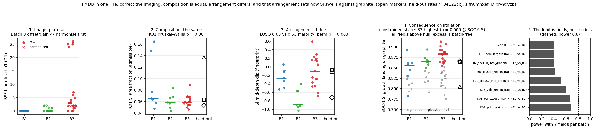

# PMDB: the story so far, in one line of argument

`python scripts/story_figure.py` redraws it from the committed outputs.

*Written as the overnight synthesis of the repository and every parallel session (KPIs, GP maps,
harmonisation, physical clean, representation learning / classification, FEM review, functional
morphology). Every claim points at the file or document that holds the numbers.*

**The question.** Three batches of a graphite/Si anode were sectioned and imaged (31 labelled fields,
7 / 7 / 17; three held-back fields to assign). Batch 3 is the supplier baseline. Are the batches
different in a way that matters for the electrode, and can that difference be measured from SEM
cross-sections reproducibly enough to serve as QC?

## 1. First, make the images comparable (`docs/harmonisation.md`, `docs/clean.md`)
Before any material statement, the Batch 3 images had to be shown *not* to differ for trivial
reasons. They do differ trivially: four Batch 3 sites have a +19–23 grey-level black level and
0.69× gain on every detector, five more a milder offset, and three sites were re-quantised after
capture. Two routes remove this. The LUT route (`load_site(..., harmonise="hybrid")`) fixes the
affine artefact per site; the physics route (`load_clean`) measures dark level and graphite
flat-field, masks scan bands / charging / clipping, and harmonises resolution and noise downward
to the four unflagged Batch 3 references. After cleaning, an acquisition-only classifier falls
from 0.61 to chance (0.42); what remains separable is the material intensity distribution, which
is left alone on purpose (`outputs/clean/REPORT.md`). The segmenter is percentile-anchored, so
the KPIs are *identical* on raw and harmonised images (Spearman 1.000; `outputs/v2/RESULTS.md` §2).
Everything downstream therefore stands on grey-level-invariant masks.

## 2. Composition is the same (`docs/kpis/`, `outputs/kpis/site_kpis.csv`)
Kevin's spec-002 KPI pipeline (25 KPIs, 43 columns, 31/31 sites, 64 s) gives Si area fraction
K01 = 4.4–16.5 % with batch medians 6.5 / 5.9 / 5.9 % (Kruskal–Wallis p = 0.38). Porosity is
3–5 % everywhere. Two Batch 1 fields (`4ih2ggld`, `5n1q8atc`) carry 2–3× the Si of any other
field. Nothing in composition separates the batches.

## 3. Arrangement is not (`docs/fingerprint.md`)
Field-level geometry does: relative Si depth-band profile, directional pair-correlation excess
(x vs z) and the tile spread of Si–graphite contact (K15). A weight-free robust naive-Bayes
fingerprint on these 16 features reaches leave-one-site-out accuracy 0.677 against a 0.548
majority baseline, permutation p = 0.002 (10 000 permutations, `outputs/overnight/permutation/`),
with Batch 2 the hardest (recall 0.43). "Composition is identical, arrangement is not" is the
repository's central material claim, and the 31-site sample size is its central caveat.
The v2 "stretch" clustering KPIs (two-point cluster length, Euler merge radius, H0 persistence,
Minkowski anisotropy; `docs/kpis/stretch.md`) were implemented overnight to close that family:
they restate K02/K03/K04/K11 (Spearman 0.8–0.97), separate no batches, and *lower* the
fingerprint's accuracy when appended (0.68 → 0.39) — the clustering content of these sections is
already in v1.

## 4. Where in the field, and how sure (GP session)
The Gaussian-process track turns the same tile KPIs into spatial maps: one GP per KPI over
64-px tile positions (RBF + white noise), giving a smoothed KPI surface, a pointwise uncertainty,
and a fitted lengthscale that acts as a clump-size proxy. It is the tool for *within-field*
heterogeneity and for equivalence-style batch decisions with confidence intervals, not a
classifier.

## 5. What an image model learns, and what it should not (`outputs/v2/RESULTS.md`)
Representation learning asked whether a neural network *contains* the KPI information. The
KPI-headed VAE-C on the harmonised three-detector stack exposes the gated KPIs with ridge-probe
R² = 0.84 on held-out fields with no imaging-statistic leakage; self-supervised and off-the-shelf
encoders (MAE, DINOv2, NASA MicroNet) score 0.26–0.66 and encode texture first. Batch
classification tells the cautionary half of the story: field accuracy 0.55–0.72 across five
architectures, Batch 1 vs 2 at chance, and Batch 3 recognised through **lower BSE noise and
sharpness** — two scalar statistics alone recognise 88 % of Batch 3 fields, adding 6 grey levels
of noise destroys the recognition, and occlusion / Grad-CAM attributions sit diffusely on the
graphite matrix in proportion to its area. The visible "batch difference" an unconstrained model
finds is microscope texture, not microstructure, and six fields are misfiled by every model.

## 6. What the arrangement means for the electrode (`docs/functional.md`, this session)
The missing layer was function: given where the Si sits, what happens when it lithiates? The
pore phase does not percolate in any 2D section (0 / 31, 3–5 % porosity), so tortuosity is not
measurable from a slice and is recorded as such rather than reported. What is measurable is the
swelling budget: grown to its lithiated area, 77–88 % of Si growth lands on graphite, 5–6 % on
pore. Two readings come out of it, with different standing:

- **Pore loss (13–25 %) is robust.** It is a function of Si fraction alone, it reproduces under an
  independently written segmenter (ρ 0.97, `docs/reliability.md` §3), and it predicts the FEM's
  pore closure across 34 sites (ρ 0.73; 0.49 after removing Si fraction, `docs/crosswalk.md` §2).
  Split by depth it follows the fingerprint's depth profile — Batch 2's mid-depth Si depletion is a
  mid-depth pore-loss minimum (p = 0.003), Batch 3 is flat, Batch 1 bottom-heavy — so the
  arrangement difference *is* a depth profile of pore-closure risk. The high-Si Batch 1 fields (and
  held-out 3e122cbj) are the pore-closure risk.
- **The constrained share is segmenter-dependent.** Under `pmdb.segment` v0r1 it differs by batch
  (B1 < B2 < B3, p = 0.009) and would be the lithiation reading of K15; under the second segmenter
  the difference vanishes (p 0.73). It is not the grey-level artefact (harmonised BSE gives the same
  masks) — it is v0r1's graphite-vs-binder split, a morphological residue rather than a measured
  phase, ≈ 1 % of the field with no intensity identity in BSE, Inlens or SE (`docs/reliability.md` §3).
  It cannot be validated with this data and is not reported as a material result.

Neither column improves batch identification (LOSO 0.71 vs 0.68, same permutation p); they
explain what the identified difference would do.

## 7. From geometry to mechanics (`docs/fem/literature-review.md`, `analytical_benchmarks/`)
The FEM review sets out the plane-strain finite-strain lithiation model (eigenstrain, neo-Hookean,
SOC-dependent properties) that would turn "Si pressing on graphite" into stress, and the
analytical benchmarks give order-of-magnitude swelling and cycling estimates. Neither is
calibrated to this material; §6 tells them which fields and which batch to simulate first.

## 8. What would settle it
The chain is consistent — artefacts removed, composition equal, arrangement different, the
difference material rather than textural, its functional consequence identified — but every link
runs on 7 fields per batch. A plug-in power analysis (`outputs/functional/power.csv`) says the
strongest KPI effects need ≈ 10–15 fields per batch for 80 % power and most need more than 50;
with the current sample the power to confirm even the largest effect is ≈ 0.6. Splitting the
variance into sampling and field components (`docs/reliability.md` §4) adds the direction: for every
KPI with a real field-level signal, sampling noise is only 12–22 % of the field variance, so **bigger
fields do not buy power — only more fields do** (K15 needs ≈ 50 per batch even at infinite area).
The three things that would move the project most are therefore not models: (i) more Batch 1 and
Batch 2 fields, (ii) the Batch 3 microscope session logs (or one Batch 3 sample re-imaged under
Batch 1/2 settings) to close the noise/sharpness question, and (iii) a labelled patch set or an
EDS carbon/fluorine map to give the binder / carbon phase a measured identity — the only way to
decide whether the constrained-swelling difference is real.

On the held-back sites every method agrees on two of three (`docs/crosswalk.md` §1): 3e122cbj → Batch 1
(unanimous, and the only field outside the Batch 3 baseline — off on 8 KPIs beyond its own sampling
noise: twice the Si, denser, closer-packed, less graphite contact; `docs/acceptance.md` §5),
fn0mhxef → Batch 3 (6 of 7). xrv9xvzb splits along the story's own fault line: methods that read depth
arrangement (fingerprint, RF arms with FEM curves) say Batch 2 and its depth-resolved pore loss shows
the Batch 2 mid-depth dip; scalar composition/geometry methods say Batch 3, and on every resolvable
KPI it sits inside the Batch 3 cloud — as do fn0mhxef and, apart from the two high-Si fields, most
Batch 1 and Batch 2 fields: at KPI level an off-baseline field deviates from Batch 3 on as many
columns (median 1) as a Batch 3 field does from the rest of Batch 3. The per-field "why" has to come
from arrangement, and should be presented as such.

The functional layer inherits the first link of the chain directly: the segmenter is anchored on
each image's own p1/p50/p99, so the Batch 3 affine artefact does not reach it — segmenting the
hybrid-harmonised BSE instead of the raw one gives Si masks with IoU ≥ 0.992 on the four
strong-offset fields (`71vgq3fw`, `kbdh4tri`, `9luzk4jm`, and high-Si `4ih2ggld` as control) and
moves the constrained share and pore loss by ≤ 0.003.

A random-relocation null (same Si objects, same graphite, random arrangement) shows the
Si-on-graphite preference is real and universal — every field has ~0.25 more K15 contact and half
the pore loss of its null — but the *excess* is the same in every batch (p = 0.56): the batch
difference lives in geometry the null preserves, not in an extra placement preference
(`docs/functional.md` §2.6).

And the question the organiser actually asked — *is this field inside the Batch 3 baseline?* — is
the one the data answer worst: the best of 84 columns rejects non-baseline fields with AUC 0.74,
which is exactly the best-of-84 chance level (permutation p = 0.50), and the fingerprint's own
Batch-3-vs-rest AUC is 0.56; its 0.68 accuracy comes from recognising Batch 1 and the B1/B2 contrast. Batch 3 is the wide batch,
the others sit inside it (`docs/acceptance.md`).

Scoring a whole pre-specified family at once (RMS of leave-one-out robust z vs Batch 3, no column
search; `docs/acceptance.md` §4) gives the same picture with one nuance: composition KPIs AUC 0.50 and
fingerprint 0.54 carry no Batch 3 boundary, the functional family reaches 0.71 (perm p 0.027, ≈ 0.08
after correcting for three families). The lithiation geometry is the only place a Batch 3 acceptance
rule could come from, and with 14 non-baseline fields it is a hint, not a rule. Held-out: 3e122cbj is
outside Batch 3 on composition and function; fn0mhxef and xrv9xvzb are inside on everything. Per-field
swelling QC sheets for all 31 labelled fields: `outputs/functional/figures/swelling_cards_Batch_*.png`.

### Where each piece lives
| Layer | Session / branch | Files |
|---|---|---|
| Loader, cache, harmonisation | main | `pmdb/io.py`, `pmdb/harmonise.py`, `docs/harmonisation.md` |
| Physical clean | main | `pmdb/clean.py`, `docs/clean.md`, `outputs/clean/` |
| KPIs (spec 002) | Kevin's KPI session, PRs #1/#4/#5 | `pmdb/kpis/`, `docs/kpis/`, `outputs/kpis/` |
| Fingerprint + overnight validation | main | `pmdb/fingerprint.py`, `docs/fingerprint.md`, `outputs/fingerprint/`, `outputs/overnight/` |
| GP tile maps, physics estimates | `analytical-benchmarks` | `analytical_benchmarks/` |
| Representation learning, classification, attribution | `devin/1791038010-v2-representation` | `outputs/v2/RESULTS.md`, `src/v2/` |
| FEM lithiation model review | `fem-lit-review`, `fem-sim` | `docs/fem/literature-review.md` |
| Functional morphology | this session | `pmdb/functional.py`, `docs/functional.md`, `outputs/functional/` |
| Cross-session crosswalk, depth swelling | this session | `docs/crosswalk.md`, `outputs/crosswalk/`, `outputs/functional/depth_swelling.csv` |
| Reliability: ICC, sectioning, second segmenter, fields vs area | this session | `docs/reliability.md`, `outputs/{reliability,sectioning,segagree}/` |
| Acceptance vs Batch 3, per-field deviation table | this session | `docs/acceptance.md`, `outputs/acceptance/` |
| FEM production, two-stage RF classifier, pitch clips | main (fem-sim, classifier, status sessions) | `outputs/fem/`, `docs/fem/results.md`, `docs/classifier/`, `outputs/clips/` |

**Addendum (pretrained spine on the swelling targets, `docs/spine.md`).** Asked whether a frozen vision
backbone (as in v2) is the right model for the lithiation geometry: no. The constrained share is read off
five mask fractions at site R² 0.91 and a spine adds nothing; pore loss gains ≈ 0.05 site R² from
MicroNet features (n.s. on 31 fields). MicroNet > DINOv2 throughout, as in v2. The segmentation is the
model; the deep embedding is a lossy re-estimate of it.

**Addendum (cross-session crosswalk, `docs/crosswalk.md`).** Put next to each other: (i) the held-out calls
of every session agree on 3e122cbj (Batch 1, the only field outside the Batch 3 baseline) and fn0mhxef
(Batch 3); xrv9xvzb splits exactly along the story's fault line — arrangement-reading methods say Batch 2,
scalar composition/geometry methods say Batch 3. (ii) The 13-second geometric swelling test predicts the
FEM's pore closure at ρ 0.73 (0.49 after removing Si fraction), so pore-closure ranking does not need the
FEM. (iii) Run per depth band, pore loss follows the fingerprint's depth profile (Batch 2 mid-depth dip,
KW p 0.003; constrained share depth-independent): the arrangement difference *is* the depth profile of
pore-closure risk.

**Addendum (sampling and segmentation, `docs/reliability.md`).** (i) ICC from 16 tiles × 31 fields: most
site-level KPIs are 0.76–0.99 reliable at the current field size, but K07 (Clark–Evans R) is 70 %
sampling noise and K04 agglomerate fraction / K14 p50 about half; K15 contact has the largest batch range
relative to its own sampling noise (1.8 SD) — still a one-field effect, hence the power problem. (ii) A
synthetic 3D sectioning model puts ~44 % of the within-Batch-3 Si-fraction spread down to where the plane
cut; number density, size and pore loss are not sectioning-limited. Real Si–graphite contact is far more
consistent across sections than random geometry allows. (iii) An independently written segmenter
reproduces Si fraction, the two high-Si outliers and pore loss (ρ 0.86–0.97) but **not** the
constrained-share batch difference (KW p 0.015 → 0.73): that result is about the v0r1 graphite/binder
split and is downgraded to a segmentation-dependent observation.
(iv) Fields vs area: for every KPI with a real field-level signal, sampling noise is only 12–22 % of the
field variance, so bigger fields do not buy power — K15 needs ≈ 50 fields per batch for 80 % power even at
infinite area (`docs/reliability.md` §4). The binding constraint is the number of fields.

